---
## Front matter
lang: ru-RU
title: Лабораторная работа №1
subtitle: Работа с git, создание виртуальной машины
author:
  - Губина О. В.
institute:
  - Российский университет дружбы народов, Москва, Россия
date: 9 сентября 2023

## i18n babel
babel-lang: russian
babel-otherlangs: english

## Formatting pdf
toc: false
toc-title: Содержание
slide_level: 2
aspectratio: 169
section-titles: true
theme: metropolis
header-includes:
 - \metroset{progressbar=frametitle,sectionpage=progressbar,numbering=fraction}
 - '\makeatletter'
 - '\beamer@ignorenonframefalse'
 - '\makeatother'
---

# Информация

## Докладчик

  * Губина Ольга Вячеславовна
  * студент(-ка) уч. группы НПИбд-01-20
  * Российский университет дружбы народов
  * [1032201737@pfur.ru](mailto:1032201737@rudn.ru)
  * <https://github.com/ovgubina>

# Вводная часть

## Актуальность

- Важно уметь работать с системой управления git для комфортной совместной работы
- Возможность воспользоваться при необходимости любым видом ОС

## Объект и предмет исследования

- Клонирование репозиториев и их настройка
- Образ Rocky Linux dvd

## Цели и задачи

- Создать новый репозитоорий курса по шаблону с соответствующими наименованиями
- Создать ВМ redhat

## Материалы и методы

- Распределённая система управления версиями [Git](https://github.com/)
- Oracle VM VirtualBox

# Процесс выполнения работы

## Создание репозитория

Создали репозиторий по [шаблону](https://github.com/yamadharma/course-directory-student-template) вручную через [Git](github.com)

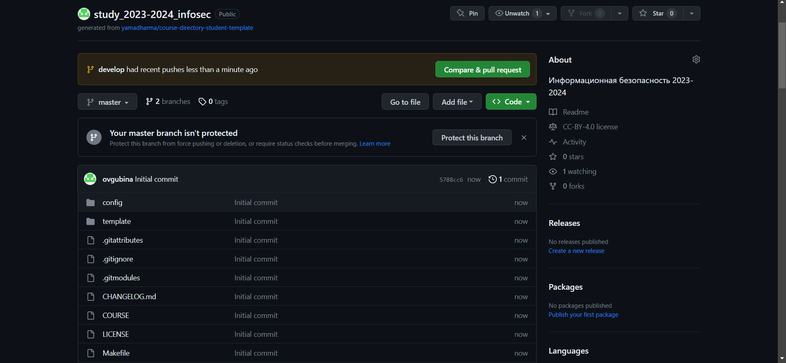{width=60%}

## Рекурскивное клонирование репозитория

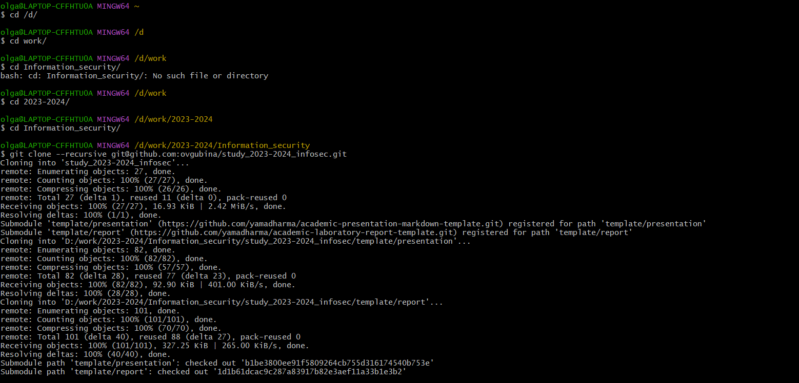{width=70%}

## Отправка файлов на сервер

  ```
  git add .
  git commit -am 'make course structure'
  ```
  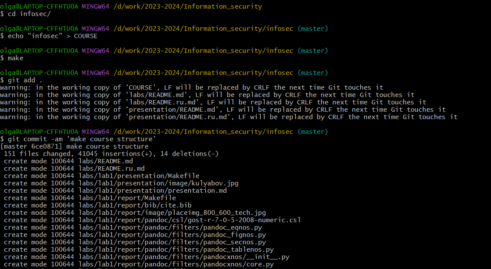{width=40%}

  ```
  git push
  ```
  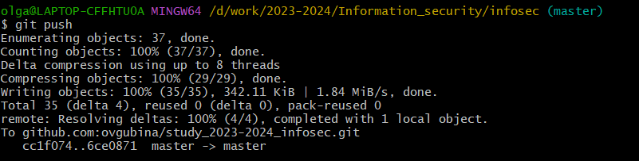{width=40%}

## Создание виртуальной машины

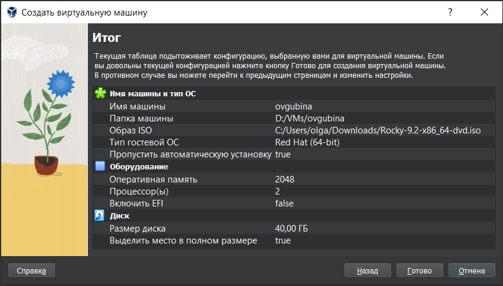{width=80%}

## Выбор программ

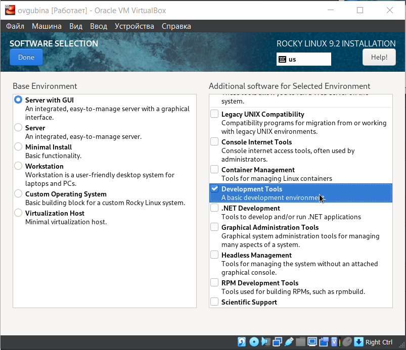{width=60%}

## Отключение KDUMP

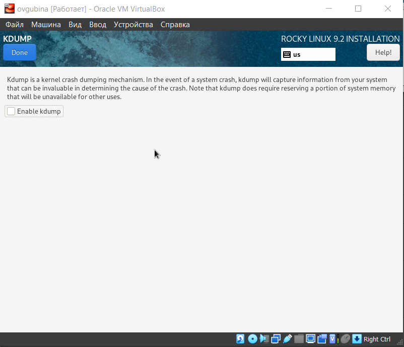{width=60%}

## Место для установки

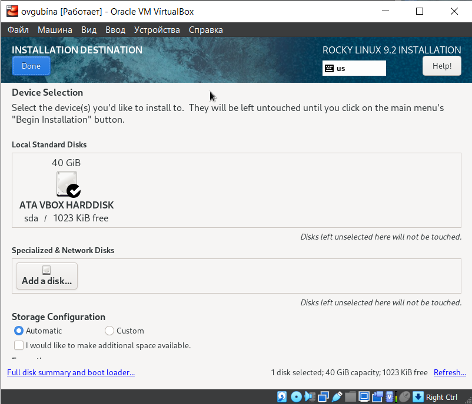{width=60%}

## Сеть и имя узла

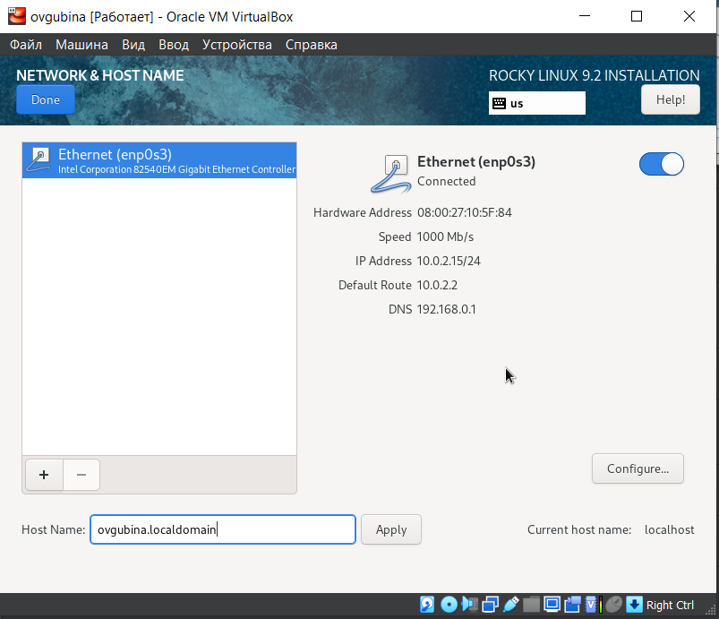{width=60%}

## Установка пароля для root

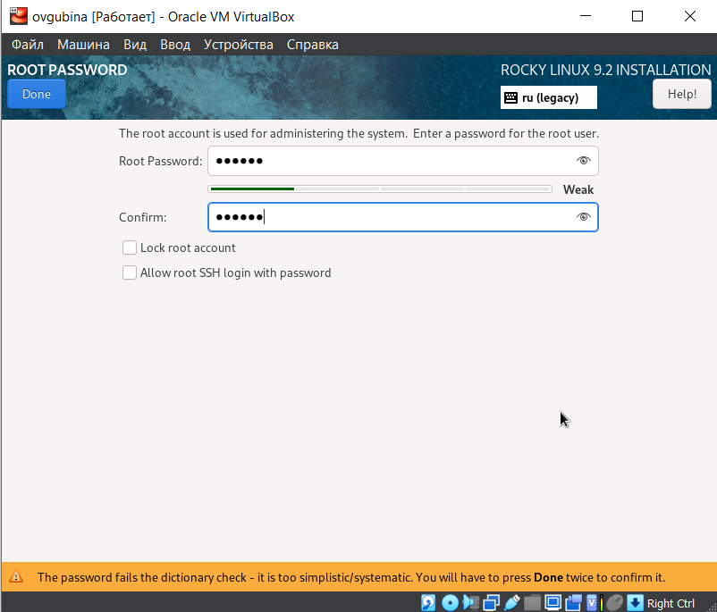{width=60%}

## Установка образа

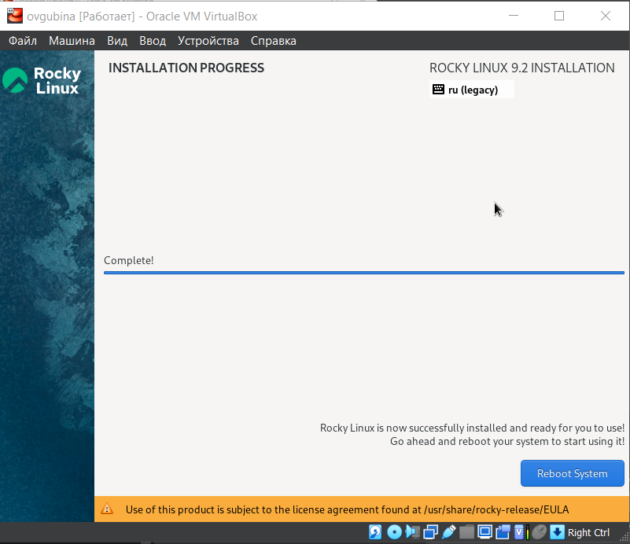{width=60%}

## Создание пользователя

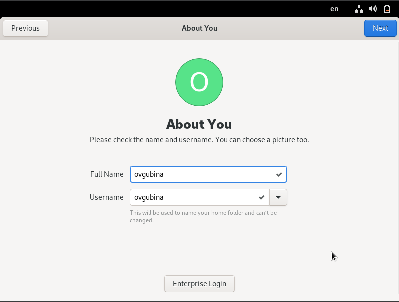{width=60%}

## Создание пароля для пользователя

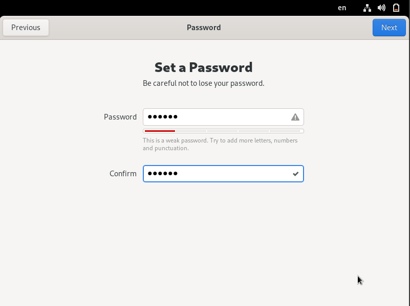{width=60%}

# Результаты работы

- Создан и настроен новый репозиторий курса на github.com
- Создана ВМ в соответствии с требованиями

# Вывод

Освоила создание репозитория дисциплины на git.com в соответствие с требованиями по шаблону и соблюдением соглашения наименований, соглашения для путей к файлам; создала виртуальную машину на основе предложенного образа.

[def]: ttps://github.com/ovgubina