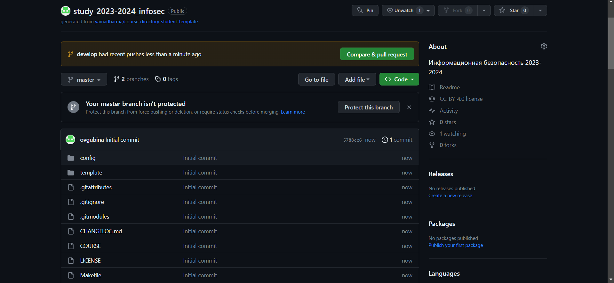

---
## Front matter
title: "Отчет по лабораторной работе №1"
subtitle: "Дисциплина: Информационная безопасность"
author: "Выполнила: Губина Ольга Вячеславовна"

## Generic otions
lang: ru-RU
toc-title: "Содержание"

## Bibliography
bibliography: bib/cite.bib
csl: pandoc/csl/gost-r-7-0-5-2008-numeric.csl

## Pdf output format
toc: true # Table of contents
toc-depth: 2
lof: true # List of figures
lot: true # List of tables
fontsize: 12pt
linestretch: 1.5
papersize: a4
documentclass: scrreprt
## I18n polyglossia
polyglossia-lang:
  name: russian
  options:
	- spelling=modern
	- babelshorthands=true
polyglossia-otherlangs:
  name: english
## I18n babel
babel-lang: russian
babel-otherlangs: english
## Fonts
mainfont: PT Serif
romanfont: PT Serif
sansfont: PT Sans
monofont: PT Mono
mainfontoptions: Ligatures=TeX
romanfontoptions: Ligatures=TeX
sansfontoptions: Ligatures=TeX,Scale=MatchLowercase
monofontoptions: Scale=MatchLowercase,Scale=0.9
## Biblatex
biblatex: true
biblio-style: "gost-numeric"
biblatexoptions:
  - parentracker=true
  - backend=biber
  - hyperref=auto
  - language=auto
  - autolang=other*
  - citestyle=gost-numeric
## Pandoc-crossref LaTeX customization
figureTitle: "Рис."
tableTitle: "Таблица"
listingTitle: "Листинг"
lofTitle: "Список иллюстраций"
lotTitle: "Список таблиц"
lolTitle: "Листинги"
## Misc options
indent: true
header-includes:
  - \usepackage{indentfirst}
  - \usepackage{float} # keep figures where there are in the text
  - \floatplacement{figure}{H} # keep figures where there are in the text
---

# Цель работы

### Цель работы:
Создание репозитория дисциплины на github.com в соответствие с требованиями по шаблону и соблюдением соглашения наименований, соглашения для путей к файлам; Создание виртуальной машины в соответствии с соглашением о наименовании типа RedHat для возможность осуществления дальнейшей работы на курсе.

# Задание

1. Создать рабочую директорию и репозиторий дисциплины на github.com в соответствие с:
  - шаблоном;
  - соглашением наименований;
2. Создать виртуальную машину.

# Теоретическое введение

В данной работе мы будем взаимодействовать с ***github.com***, где будем выгружать лабораторные работы.

**Git** — распределённая система управления версиями. Проект был создан *Линусом Торвальдсом* для управления разработкой ядра Linux, первая версия выпущена 7 апреля 2005 года. На сегодняшний день его поддерживает Джунио Хамано.

Для того, чтобы git узнал наше имя и электронную почту, необходимо выполнить следующие действия в командной строке:

```git config --global user.name "Your Name"
git config --global user.email "your_email@whatever.com"
```

Однако, с прошлого года сохранились некоторые данные, поэтому в моем случае этого делать не пришлось.

Отчеты по лабораторным работам данной дисциплины будем писать с использованием ***markdown***.

**Markdown** — облегчённый язык разметки, созданный с целью обозначения форматирования в простом тексте, с максимальным сохранением его читаемости человеком, и пригодный для машинного преобразования в языки для продвинутых публикаций.

Теперь в табл. @tbl:1 рассмотрим основные сведения и функции языка разметки.

: Описание некоторых функций языка разметки markdown {#tbl:1}

| Символьное обозначение в коде      | Описание                                                                                                           |
|--------------|----------------------------------------------------------------------------------------------------------------------------|
| `#`          | Создание заголовка первого порядка (всего порядков шесть, кол-во символов `#` обозначаем номер порядка)                                                                        |
| `** **`      |Задает полужирное начертание текста    |
| `* *`       | Задает курсивное начертание текста                                           |
| `*** ***`      | Задает курсивное полужирное начертание текста |
| `-`  или `*`   | Задает элемент неупорядоченного маркированного списка                                                                              |
| ` ``` ``` `      | Задает выделенные блоки кода                                                                                   |
Более подробно о git и markdown см. в [@git-wiki;@git;@markdown-wiki;@markdown].

Также будем использовать дистрибутив Rocky Linux. **Rocky Linux** — это дистрибутив Linux, разработанный *Rocky Enterprise Software Foundation*. Предполагается, что это будет полный бинарно-совместимый выпуск, использующий исходный код операционной системы **Red Hat** Enterprise Linux.

Некоторые образы ISO, выпущенные Rocky Enterprise Software Foundation, не имеют прямых эквивалентов вышестоящего уровня. Они создаются для определенных целей, например, для предоставления живого загрузочного образа или для предоставления установочного носителя уменьшенного размера [@rocky].

# Выполнение лабораторной работы

1. Авторизуемся на github.com (рис. [@fig:01]).

{#fig:01 width=50%}

2. Далее нам необходимо создать каталог, где будут располагаться все лабораторные работы, в моем случае: /d/work/2023-2024/Information_security(рис. @fig:02). Полное название предмета написано на латиницей, посколько при попытке сделать мейк возникала ошибка, то же и с пробелом - вместо него нижнее подчеркивание. 

{#fig:02 width=70%}

3. Создадим репозиторий по предложенному шаблону вручную через [git.com](git.com) с наименованием study_2023-2024_infosec (рис. [@fig:03]).

{#fig:03 width=70%}

Видим, что репозиторий успешно создан в нашем профиле (рис. [@fig:04]).

{#fig:04 width=70%}

4. Через Git Bash подключим репозиторий к директории. 

С прошлого предмента все ключи у меня сохранились, поэтому сначала переходим в наш рабочий каталог и выполняем команду (рис. [@fig:06]):

```git clone --recursive <repo_name_ssh>```

{#fig:06 width=70%}

После этого действия в рабочем каталоге появляется папка согласно названиию репозитория - study_2023-2024_infosec, для удобства я переименовала эту папку в infosec.

Далее мы переходим в созданную папку в Git Bash (предвалительно я вручную удалила файл package.json) и создаем необходимые каталоги (рис. [@fig:07]):

```
echo "infosec" > COURSE
make
```
После этого Отправляем файлы на сервер (рис. [@fig:07]-[@fig:08]):
```
git add .
git commit -am '<commit_name>'
git push
```
{#fig:07 width=70%}
{#fig:08 width=70%}

Переходим на github и видим, что создалась папка labs - изменения внесены успешно (рис. [@fig:09]):

{#fig:09 width=70%}

5. Теперь перейдем к созданию виртуальной машины.

Для этого предварительно был скачан образ Rocky Linux 9.2 dvd.

Создаем виртуальную машину в соответствие с соглашением о наименовании, на диск D, используя установленный образ (рис. [@fig:10]):

{#fig:10 width=70%}

Выбираем параметры будущей машины - основная память 2Гб, 2 процессора, размер виртуального жесткого диска 40Гб (рис. [@fig:11]-[@fig:13])

{#fig:11 width=70%}

{#fig:12 width=70%}

{#fig:13 width=70%}

Виртуальная машина успешно создана (рис. [@fig:14]):

{#fig:14 width=70%}

6. Запускаем виртуальную машину (рис. [@fig:15]):

{#fig:15 width=70%}

7. Далее необходимо произвести настройку Rocky Linux и выбрать язык (рис. [@fig:16]-[@fig:17]).

{#fig:16 width=70%}

{#fig:17 width=70%}

В разделе выбора программ указываем в качестве базового окружения
Server with GUI, а в качестве дополнения — Development Tools (рис. [@fig:18])

{#fig:18 width=70%}

Отключаем KDUMP (рис. [@fig:19]):

{#fig:19 width=70%}

Место установки ОС оставляем без изменений (рис. [@fig:20]):

{#fig:20 width=70%}

Включим сетевое соединение и в качестве имени узла указываем ovgubina.localdomain (рис. [@fig:21]) в соответствии с соглашением об именовании.

{#fig:21 width=70%}

Проверяем дополнительные настройки (рис. [@fig:22]-[@fig:23]):

{#fig:22 width=70%}

{#fig:23 width=70%}

Соглашаемся с политикой безопасновти (рис. [@fig:24]):

{#fig:24 width=70%}

Устанавливаем пароль для пользователя root (рис. [@fig:25]):

{#fig:25 width=70%}

После этого мы можем начать установку (рис. [@fig:26]):

{#fig:26 width=70%}

Видим, что установка завершена, перезапускаем систему (рис. [@fig:27]):

{#fig:27 width=70%}

После перезапуска настраиваем ОС под пользователя (рис. [@fig:28]-[@fig:33]).

{#fig:28 width=70%}

{#fig:29 width=70%}

{#fig:30 width=70%}

{#fig:31 width=70%}

{#fig:32 width=70%}

{#fig:33 width=70%}

В меню "Устройства виртуальной машины" подключим образ диска дополнений гостевой ОС (рис. [@fig:34]-[@fig:35]), вводим пароль пользователя root виртуальной ОС (рис. [@fig:36]).

{#fig:34 width=70%}

{#fig:35 width=70%}

{#fig:36 width=70%}

8. После перезапуска начинаем работу с домашним заданием.

Дождидаемся загрузки графического окружения и открываем терминал. В окне
терминала просмотрим последовательность загрузки системы, выполнив команду ```dmesg | less``` (рис. [@fig:37]).

{#fig:37 width=70%}

Далее от нас требуется узнать:
  - Версия ядра Linux (Linux version) (рис. [@fig:38]).

    ```uname -r```

    {#fig:38 width=70%}

  - Частота процессора (Detected Mhz processor) (рис. [@fig:38]).

    ```cat /proc/cpuinfo | grep "cpu MHz``` - выводит частоту обоих процессоров - 2096.862MHz.

  - Модель процессора (CPU0).

    ```lscpu``` - раздел Vendor ID (рис. [@fig:38]).

  - Объем доступной оперативной памяти (Memory available) (рис. [@fig:39]).

    ```free```

    {#fig:39 width=70%}

  - Тип обнаруженного гипервизора (Hypervisor detected).

    ```lscpu``` - раздел Virtualization features (рис. [@fig:38]).

  - Тип файловой системы корневого раздела.

    ```lsblk -f``` - тип xfs (рис. [@fig:40])

    {#fig:40 width=70%}

  - Последовательность монтирования файловых систем (рис. [@fig:41]).

    ```mount```

    {#fig:41 width=70%}

# Выводы

Создала репозиторий study_2023-2024_infosec дисциплины Информационная базопасность на git.com в соответствие с требованиями по шаблону и соблюдением соглашения наименований, соглашения для путей к файлам; Созздала ВМ на основе образа Rocky Linux 9.2 dvd; Написала отчет при использовании языка разметки markdown по выполненной работе.

# Список литературы{.unnumbered}

::: {#refs}
:::
