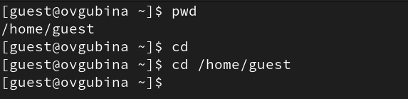
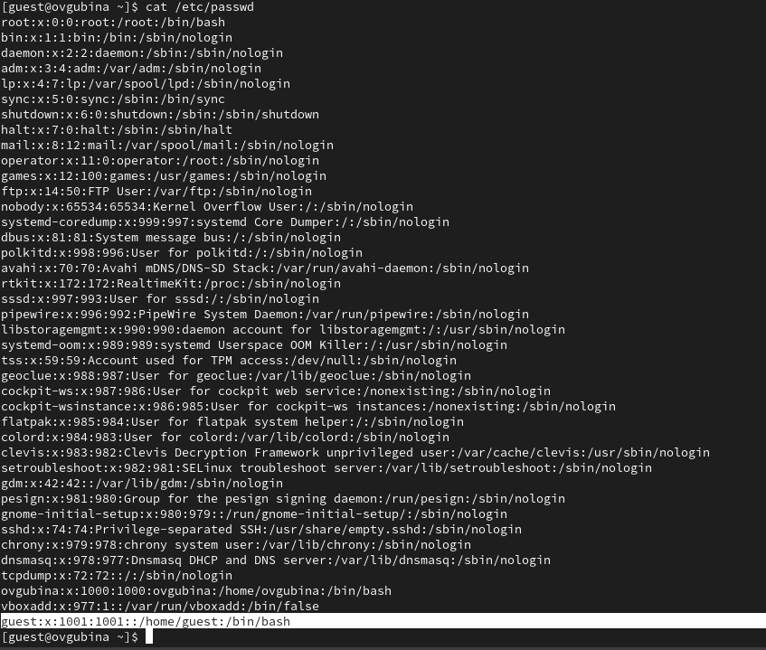
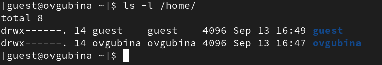
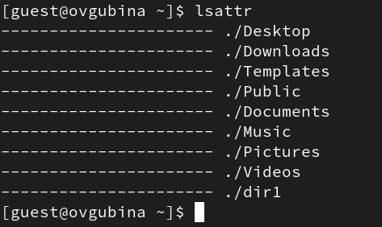
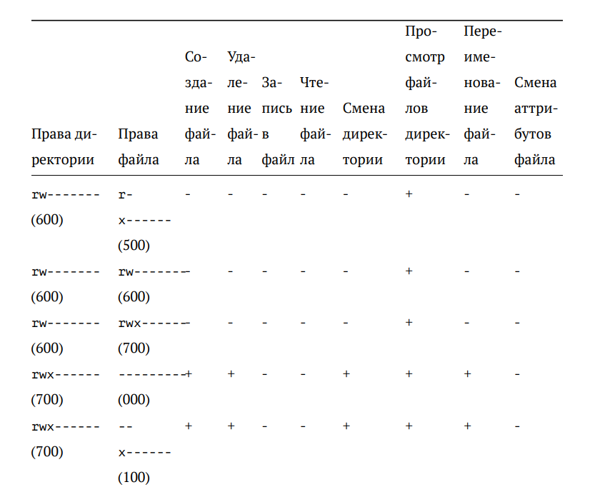
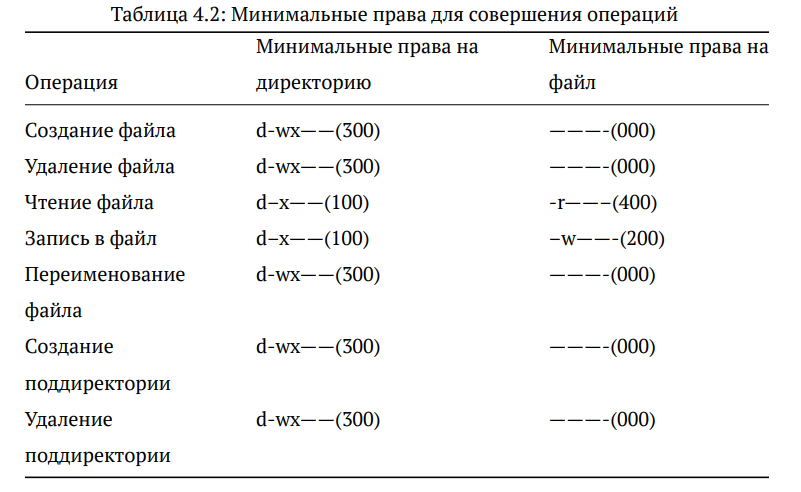

---
## Front matter
lang: ru-RU
title: Лабораторная работа №2
subtitle: Дискреционное разграничение прав в Linux. Основные атрибуты

author:
  - Губина О. В.
institute:
  - Российский университет дружбы народов, Москва, Россия
date: 16 сентября 2023

## i18n babel
babel-lang: russian
babel-otherlangs: english

## Formatting pdf
toc: false
toc-title: Содержание
slide_level: 2
aspectratio: 169
section-titles: true
theme: metropolis
header-includes:
 - \metroset{progressbar=frametitle,sectionpage=progressbar,numbering=fraction}
 - '\makeatletter'
 - '\beamer@ignorenonframefalse'
 - '\makeatother'
---

# Информация

## Докладчик

  * Губина Ольга Вячеславовна
  * студент(-ка) уч. группы НПИбд-01-20
  * Российский университет дружбы народов
  * [1032201737@pfur.ru](mailto:1032201737@rudn.ru)
  * <https://github.com/ovgubina>

# Вводная часть

## Актуальность

- Необходимость понимания возможножностей, предоставляемых различными правами доступа. 

## Объект и предмет исследования

- Права доступа файлов и директорий 

## Цели и задачи

- Произвести работу в консоли с атрибутами от имени пользователя *guest*
- Сотавить опытным путем таблицы "Установленные права и разрешенные действия" и "Минимальные права для совершения операций"

## Материалы и методы

- Командная строка ОС Linux

# Процесс выполнения работы

## Создание учетной записи guest


## Домашняя директория пользователя guest



## Информация о пользователе guest


## Файл /etc/passwd



## Директории в /home/



## Расширенные атрибуты поддиректории


## Атрибуты директорий

:::::::::::::: {.columns align=center}
::: {.column width="50%"}


:::
::: {.column width="50%"}


:::
::::::::::::::

## Действия для заполнения таблицы "Установленные права и разрешенные действия"

- ```cd dir1``` - смена директории;
- ```touch <новый_файл>``` - создание файла;
- ```rm <новый_файл>``` - удаление файла;
- ```ls -l (dir1)``` - просмотр файлов в директории;
- ```echo "test" > <файл_с_установленными_правами>``` - запись в файл;
- ```cat <файл_с_установленными_правами>``` - чтение файла;
- ```mv <файл_с_установленными_правами> <переименование>``` - переименование файла;
- ```chattr <атрибуты> <файл_с_установленными_правами>``` смена атрибутов файла.

## Пример выполнения команд


## Таблица "Установленные права и разрешенные действия"



## Таблица "Минимальные права для совершения операций"



# Результаты работы

- Произвела работу в консоли с атрибутами от имени пользователя *guest*;
- Сотавила опытным путем таблицы "Установленные права и разрешенные действия" и "Минимальные права для совершения операций".

# Вывод

Получила практические навыки работы в консоли с атрибутами файлов, закрепила теоретические основы дискреционного разграничения доступа в современных системах с открытым кодом на базе ОС Linux. Заполнила опытным путем таблицы "Установленные права и разрешенные действия" и "Минимальные права для совершения операций".

[def]: ttps://github.com/ovgubina