---
## Front matter
title: "Лабораторная работа №2"
subtitle: "Дисциплина: Информационная безопасность"
author: "Губина Ольга Вячеслвовна"

## Generic otions
lang: ru-RU
toc-title: "Содержание"

## Bibliography
bibliography: bib/cite.bib
csl: pandoc/csl/gost-r-7-0-5-2008-numeric.csl

## Pdf output format
toc: true # Table of contents
toc-depth: 2
lof: true # List of figures
lot: true # List of tables
fontsize: 12pt
linestretch: 1.5
papersize: a4
documentclass: scrreprt
## I18n polyglossia
polyglossia-lang:
  name: russian
  options:
	- spelling=modern
	- babelshorthands=true
polyglossia-otherlangs:
  name: english
## I18n babel
babel-lang: russian
babel-otherlangs: english
## Fonts
mainfont: PT Serif
romanfont: PT Serif
sansfont: PT Sans
monofont: PT Mono
mainfontoptions: Ligatures=TeX
romanfontoptions: Ligatures=TeX
sansfontoptions: Ligatures=TeX,Scale=MatchLowercase
monofontoptions: Scale=MatchLowercase,Scale=0.9
## Biblatex
biblatex: true
biblio-style: "gost-numeric"
biblatexoptions:
  - parentracker=true
  - backend=biber
  - hyperref=auto
  - language=auto
  - autolang=other*
  - citestyle=gost-numeric
## Pandoc-crossref LaTeX customization
figureTitle: "Рис."
tableTitle: "Таблица"
listingTitle: "Листинг"
lofTitle: "Список иллюстраций"
lotTitle: "Список таблиц"
lolTitle: "Листинги"
## Misc options
indent: true
header-includes:
  - \usepackage{indentfirst}
  - \usepackage{float} # keep figures where there are in the text
  - \floatplacement{figure}{H} # keep figures where there are in the text
---

# Цель работы

Получение практических навыков работы в консоли с атрибутами файлов, закрепление теоретических основ дискреционного разграничения доступа в современных системах с открытым кодом на базе ОС Linux.

# Задание

- Произвести работу в консоли с атрибутами от имени пользователя *guest*;
- Сотавить опытным путем таблицы "Установленные права и разрешенные действия" и "Минимальные права для совершения операций".

# Теоретическое введение

В данной лабораторной работе нам предстоит поработать с правами доступа файлов и директорий. **Права доступа** определяют, какие действия конкретный пользователь может или не может совершать с определенным файлами и каталогами.

Есть 3 вида разрешений. Они определяют права пользователя на 3 действия: чтение, запись и выполнение. В Linux эти действия обозначаются вот так:

- **r** — read (чтение) — право просматривать содержимое файла;
- **w** — write (запись) — право изменять содержимое файла;
- **x** — execute (выполнение) — право запускать файл, если это программа или скрипт.

У каждого файла есть 3 группы пользователей, для которых можно устанавливать права доступа. 

- **owner** (владелец) — отдельный человек, который владеет файлом. Обычно это тот, кто создал файл, но владельцем можно сделать и кого-то другого.
- **group** (группа) — пользователи с общими заданными правами.
- **others** (другие) — все остальные пользователи, не относящиеся к группе и не являющиеся владельцами.[@01] 

Чтобы увидеть текущие назначения владельца, вы можете использовать команду ```ls -l```. Эта команда показывает пользователя и группу-владельца.

С помощью команды ```ls``` вы можете отобразить владельца файлов в данном каталоге. Иногда может оказаться полезным получить список всех файлов в системе, в которых в качестве владельца указан данный пользователь или группа. Для этого вы можете использовать find. Аргумент find -user может быть использован для этой цели.

Чтобы применить соответствующие разрешения, первое, что нужно учитывать, это владение. Для этого есть команда ```chown```.[@02]

Для того, чтобы позволить обычным пользователям выполнять программы от имени суперпользователя без знания его пароля была придумана такая вещь, как SUID и SGID биты. Рассмотрим эти полномочия подробнее.

- **SUID** - если этот бит установлен, то при выполнении программы, id пользователя, от которого она запущена заменяется на id владельца файла. Фактически, это позволяет обычным пользователям запускать программы от имени суперпользователя;
- **SGID** - этот флаг работает аналогичным образом, только разница в том, что пользователь считается членом группы, с которой связан файл, а не групп, к которым он действительно принадлежит. Если SGID флаг установлен на каталог, все файлы, созданные в нем, будут связаны с группой каталога, а не пользователя. Такое поведение используется для организации общих папок;
- **Sticky-bit** - этот бит тоже используется для создания общих папок. Если он установлен, то пользователи могут только создавать, читать и выполнять файлы, но не могут удалять файлы, принадлежащие другим пользователям.[@03]

# Выполнение лабораторной работы

1. В установленной при выполнении предыдущей лабораторной работы операционной системе создадим учётную запись пользователя guest (использую учётную запись администратора) (рис. @fig:001): ```useradd guest```.

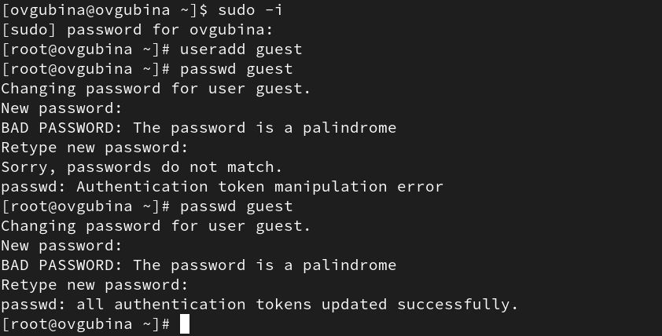{#fig:001 width=70%}

2. Зададим пароль для пользователя guest (использую учётную запись администратора) (рис. @fig:001): ```passwd guest```.

3. Перезапустила машину и вошла в систему от имени пользователя guest (рис. @fig:002).

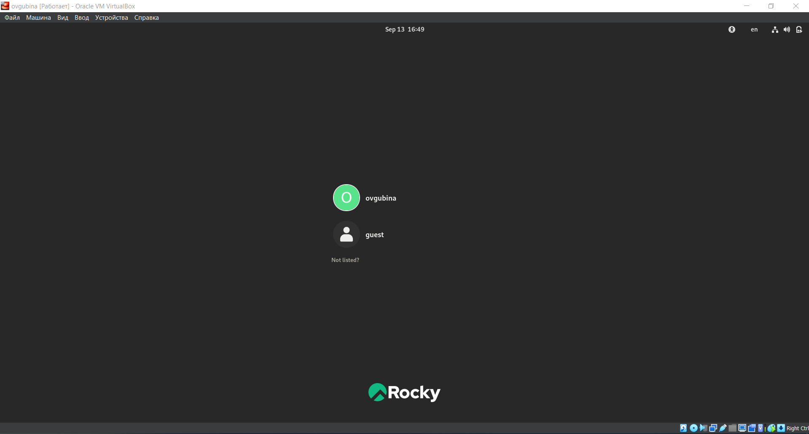{#fig:002 width=70%}

4. Определим директорию, в которой находимся, командой ```pwd```(рис. @fig:003). Сравниv её с приглашением командной строки. В командной строке видим символ ```~```, что свидетельствует о том, что мы находимся в домашней директории. Определим, является ли она действительно домашней директорией, введя команду ```cd```, которая позволяет перейти в домашнюю директорию. Видим, что ничего не меняется. **Мы находимся в своей домашней директории.**

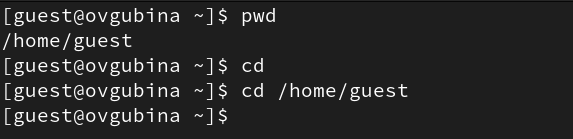{#fig:003 width=70%}

5. Уточним имя пользователя командой ```whoami``` (рис. @fig:004).

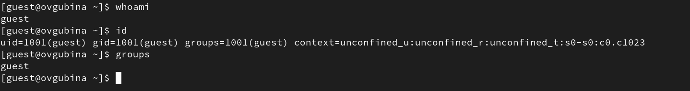{#fig:004 width=70%}

Видим, что имя нашего пользователя - **guest**.

6. Уточним имя пользователя, его группу, а также группы, куда входит пользователь, командой ```id``` (рис. @fig:004). 

Видим следующие данные: uid = 1001(guest), gid = 1001(guest), groups = 1001(guest).

Сравним вывод id с выводом команды ```groups``` (рис. @fig:004).

Данная команда показывает группы текущего пользователя, аналогично выводу команды ```id```, группы пользователя guest - это группа guest.

7. Сравните полученную информацию об имени пользователя с данными,
выводимыми в приглашении командной строки.

Команда ```whoami``` дала нам понять, что имя пользователя - guest. В начале приглашения командной строки как раз указано имя нашего пользователя - все сходится.

8. Просмотрим файл /etc/passwd (рис. @fig:005):

```
cat /etc/passwd
```

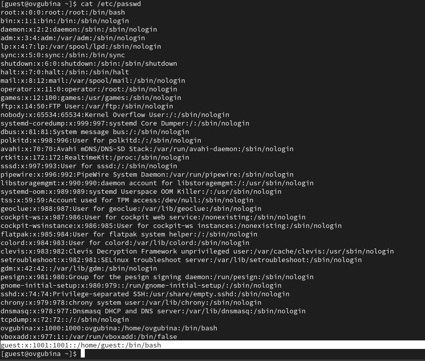{#fig:005 width=70%}

Найдем в нем последнюю запись - запись о текущем пользователе (выделено на рис. @fig:005). Данная строка показывает, что uid = 1001, gid = 1001, что соответствует результатам предыдущих команд.

9. Определим существующие в системе директории командой ```ls -l /home/``` (рис. @fig:006).

{#fig:006 width=70%}

Нам удалось получить список поддиректорий директории /home. Директории имеют следующие права: владельцы данных директорий обладают полными правами (на чтение, запись и выполнение), в то время как группы и другие пользователи обладают нулевыми правами.

10. Проверим, какие расширенные атрибуты установлены на поддиректориях, находящихся в директории /home, командой (рис. @fig:007):

```
lsattr /home
```

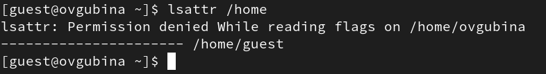{#fig:007 width=70%}

Нам удалось просмотреть расширенные атрибуты своей домашней директории - оказалось, что никаких расширенных атрибутов нет. В то же время нам отказывают в доступе к просмотру расширенных атрибутов директории другого пользователя (рис. @fig;007).

11. Создадим в домашней директории поддиректорию dir1 командой ```mkdir dir1```.

Определим командами ```ls -l```  (рис. @fig:008) и ```lsattr```  (рис. @fig:009), какие права доступа и расширенные атрибуты были выставлены на директорию dir1.

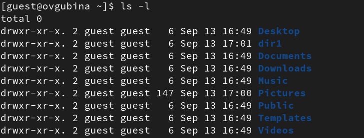{#fig:008 width=70%}

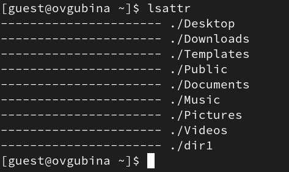{#fig:009 width=70%}

Видим, что в директории dir1 ее владелец обладает полными правами (rwx), а группы пользователей и другие пользователи имеют права только на чтение и выполнение (r-x). Расширенных атрибутов у каталога нет.

12. Снимим с директории dir1 все атрибуты командой ```chmod 000 dir1``` и проверим правильность выполнения с помощью команды ```ls -l``` (рис. @fig:010).

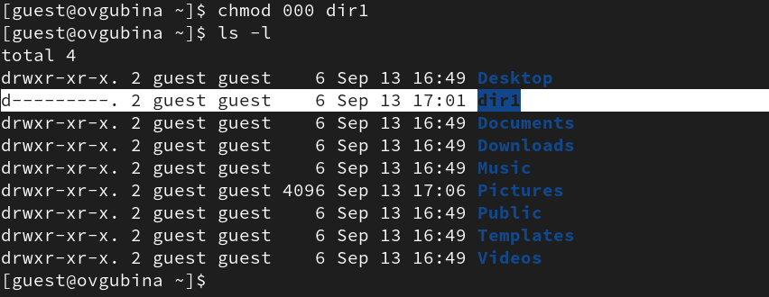{#fig:010 width=70%}

Видим, что теперь на директорию dir1 нет никаких прав.

13. Попытаемся создать в директории dir1 файл file1 командой ```echo "test" > /home/guest/dir1/file1```.

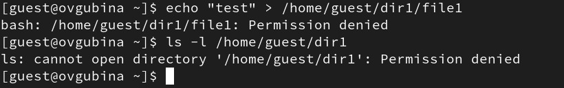{#fig:011 width=70%}

Мы получили отказ в выполнении операции по созданию файла, потому что мы не обладаем правами на это, поскольку в предыдущих шагах мы обнулили все права данного каталога.

Из-за нулевых прав мы также не можем посмотреть содержимое каталога. Если пытаться взаимодействовать с файлом система ответит, что такого файла нет, значит файл не создался, что логично, поскольку у нас нет прав на создание файлов в данной директории.

14. Заполните таблицу «Установленные права и разрешённые действия», выполняя действия от имени владельца директории (файлов), определив опытным путём, какие операции разрешены, а какие нет. Если операция разрешена, занесите в таблицу знак «+», если не разрешена, знак «-».

Для опрделения опытным путем будем использовать следующие действияв соответствие со столбцами таблицы:

- ```cd dir1``` - смена директории;
- ```touch <новый_файл>``` - создание файла;
- ```rm <новый_файл>``` - удаление файла;
- ```ls -l (dir1)``` - просмотр файлов в директории;
- ```echo "test" > <файл_с_установленными_правами>``` - запись в файл;
- ```cat <файл_с_установленными_правами>``` - чтение файла;
- ```mv <файл_с_установленными_правами> <переименование>``` - переименование файла;
- ```chattr <атрибуты> <файл_с_установленными_правами>``` смена атрибутов файла.

В качесвте примера приведу осуществление проверки для прав доступа ```drwx------ (700), ---x------(100)``` (рис. @fig:012), ```drwx------ (700), ---x------(200)```  (рис. @fig:013), ```drw------- (600), -rw-------(600)``` (рис. @fig:014), ```dr-x------ (500), -r-x------(100)``` (рис. @fig:015), ```dr-------- (400), -r--------(400)``` (рис. @fig:016), ```d-wx------ (300), --wx------(600)``` (рис. @fig:017), ```d-w------- (200), --w-------(700)``` (рис. @fig:018), ```d--x------ (100), ---x------(100)``` (рис. @fig:019).

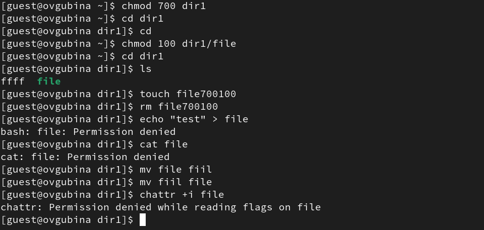{#fig:012 width=70%}

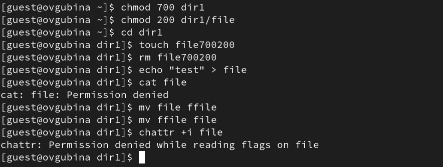{#fig:013 width=70%}

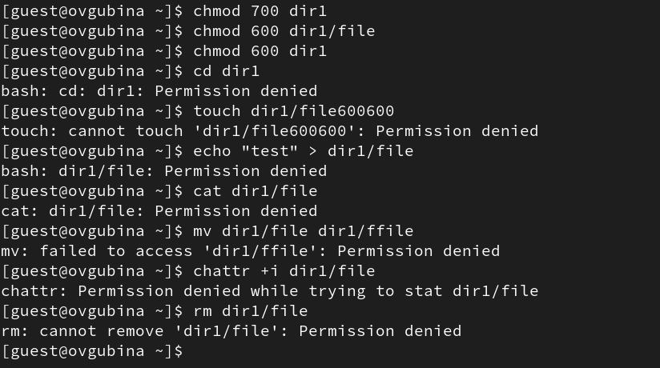{#fig:014 width=70%}

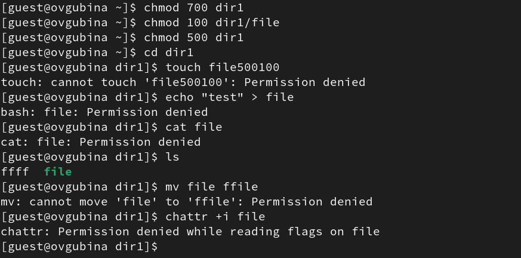{#fig:015 width=70%}

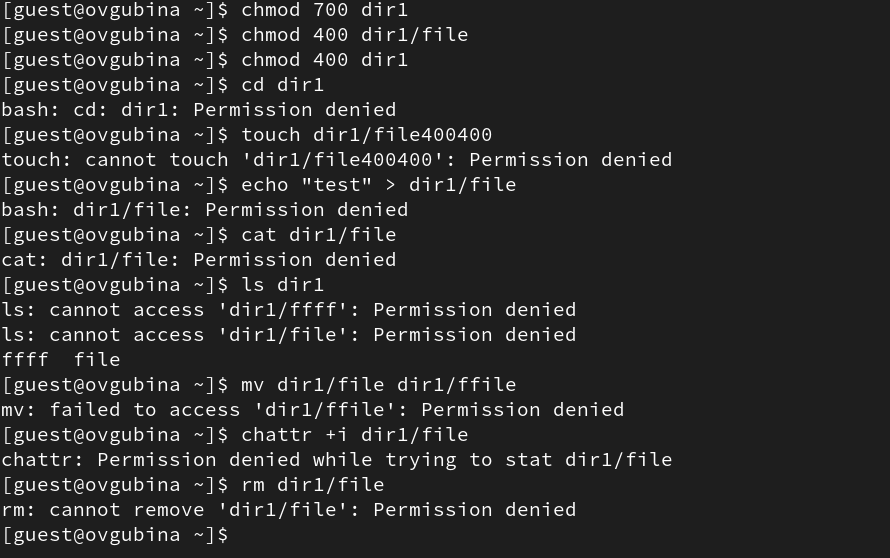{#fig:016 width=70%}

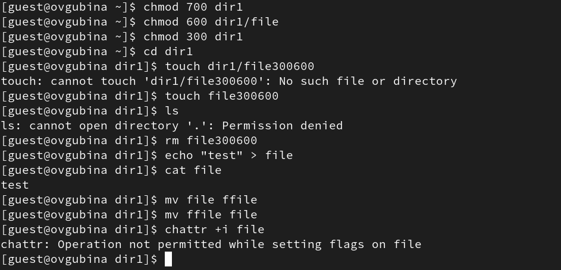{#fig:017 width=70%}

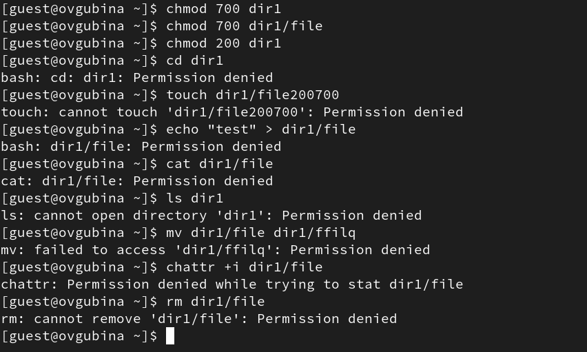{#fig:018 width=70%}

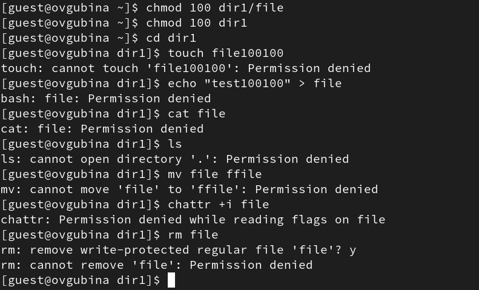{#fig:019 width=70%}

Заполненная табл. @tbl:01 краткого описания стандартных каталогов Unix.

: Установленные права и разрешенные действия {#tbl:01}

|Права директории|Права файла|Создание файла|Удаление файла|Запись в файл|Чтение файла|Смена директории|Просмотр файлов директории|Переименование файла|Смена аттрибутов файла|
|------------------|-------------|-------|-----|------|-------|------------|-----------|---------|------------|
|```---------``` (000)|```---------``` (000)| - | - | - | - | - | - | - | - |
|```---------``` (000)|```--x------``` (100)| - | - | - | - | - | - | - | - |
|```---------``` (000)|```-w-------``` (200)| - | - | - | - | - | - | - | - |
|```---------``` (000)|```-wx------``` (300)| - | - | - | - | - | - | - | - |
|```---------``` (000)|```r--------``` (400)| - | - | - | - | - | - | - | - |
|```---------``` (000)|```r-x------``` (500)| - | - | - | - | - | - | - | - |
|```---------``` (000)|```rw-------``` (600)| - | - | - | - | - | - | - | - |
|```---------``` (000)|```rwx------``` (700)| - | - | - | - | - | - | - | - |
|```--x------``` (100)|```---------``` (000)| - | - | - | - | + | - | - | - |
|```--x------``` (100)|```--x------``` (100)| - | - | - | - | + | - | - | - |
|```--x------``` (100)|```-w-------``` (200)| - | - | + | - | + | - | - | - |
|```--x------``` (100)|```-wx------``` (300)| - | - | + | - | + | - | - | - |
|```--x------``` (100)|```r--------``` (400)| - | - | - | + | + | - | - | + |
|```--x------``` (100)|```r-x------``` (500)| - | - | - | + | + | - | - | + |
|```--x------``` (100)|```rw-------``` (600)| - | - | + | + | + | - | - | + |
|```--x------``` (100)|```rwx------``` (700)| - | - | + | + | + | - | - | + |
|```-w-------``` (200)|```---------``` (000)| - | - | - | - | - | - | - | - |
|```-w-------``` (200)|```--x------``` (100)| - | - | - | - | - | - | - | - |
|```-w-------``` (200)|```-w-------``` (200)| - | - | - | - | - | - | - | - |
|```-w-------``` (200)|```-wx------``` (300)| - | - | - | - | - | - | - | - |
|```-w-------``` (200)|```r--------``` (400)| - | - | - | - | - | - | - | - |
|```-w-------``` (200)|```r-x------``` (500)| - | - | - | - | - | - | - | - |
|```-w-------``` (200)|```rw-------``` (600)| - | - | - | - | - | - | - | - |
|```-w-------``` (200)|```rwx------``` (700)| - | - | - | - | - | - | - | - |
|```-wx------``` (300)|```---------``` (000)| + | + | - | - | + | - | + | - |
|```-wx------``` (300)|```--x------``` (100)| + | + | - | - | + | - | + | - |
|```-wx------``` (300)|```-w-------``` (200)| + | + | + | - | + | - | + | - |
|```-wx------``` (300)|```-wx------``` (300)| + | + | + | - | + | - | + | - |
|```-wx------``` (300)|```r--------``` (400)| + | + | - | + | + | - | + | + |
|```-wx------``` (300)|```r-x------``` (500)| + | + | - | + | + | - | + | + |
|```-wx------``` (300)|```rw-------``` (600)| + | + | + | + | + | - | + | + |
|```-wx------``` (300)|```rwx------``` (700)| + | + | + | + | + | - | + | + |
|```r--------``` (400)|```---------``` (000)| - | - | - | - | - | + | - | - |
|```r--------``` (400)|```--x------``` (100)| - | - | - | - | - | + | - | - |
|```r--------``` (400)|```-w-------``` (200)| - | - | - | - | - | + | - | - |
|```r--------``` (400)|```-wx------``` (300)| - | - | - | - | - | + | - | - |
|```r--------``` (400)|```r--------``` (400)| - | - | - | - | - | + | - | - |
|```r--------``` (400)|```r-x------``` (500)| - | - | - | - | - | + | - | - |
|```r--------``` (400)|```rw-------``` (600)| - | - | - | - | - | + | - | - |
|```r--------``` (400)|```rwx------``` (700)| - | - | - | - | - | + | - | - |
|```r-x------``` (500)|```---------``` (000)| - | - | - | - | + | + | - | - |
|```r-x------``` (500)|```--x------``` (100)| - | - | - | - | + | + | - | - |
|```r-x------``` (500)|```-w-------``` (200)| - | - | + | - | + | + | - | - |
|```r-x------``` (500)|```-wx------``` (300)| - | - | + | - | + | + | - | - |
|```r-x------``` (500)|```r--------``` (400)| - | - | - | + | + | + | - | + |
|```r-x------``` (500)|```r-x------``` (500)| - | - | - | + | + | + | - | + |
|```r-x------``` (500)|```rw-------``` (600)| - | - | + | + | + | + | - | + |
|```r-x------``` (500)|```rwx------``` (700)| - | - | + | + | + | + | - | + |
|```rw-------``` (600)|```---------``` (000)| - | - | - | - | - | + | - | - |
|```rw-------``` (600)|```--x------``` (100)| - | - | - | - | - | + | - | - |
|```rw-------``` (600)|```-w-------``` (200)| - | - | - | - | - | + | - | - |
|```rw-------``` (600)|```-wx------``` (300)| - | - | - | - | - | + | - | - |
|```rw-------``` (600)|```r--------``` (400)| - | - | - | - | - | + | - | - |
|```rw-------``` (600)|```r-x------``` (500)| - | - | - | - | - | + | - | - |
|```rw-------``` (600)|```rw-------``` (600)| - | - | - | - | - | + | - | - |
|```rw-------``` (600)|```rwx------``` (700)| - | - | - | - | - | + | - | - |
|```rwx------``` (700)|```---------``` (000)| + | + | - | - | + | + | + | - |
|```rwx------``` (700)|```--x------``` (100)| + | + | - | - | + | + | + | - |
|```rwx------``` (700)|```-w-------``` (200)| + | + | + | - | + | + | + | - |
|```rwx------``` (700)|```-wx------``` (300)| + | + | + | - | + | + | + | - |
|```rwx------``` (700)|```r--------``` (400)| + | + | - | + | + | + | + | + |
|```rwx------``` (700)|```r-x------``` (500)| + | + | - | + | + | + | + | + |
|```rwx------``` (700)|```rw-------``` (600)| + | + | + | + | + | + | + | + |
|```rwx------``` (700)|```rwx------``` (700)| + | + | + | + | + | + | + | + |

15. На основании заполненной таблицы @tbl:01 определите те или иные минимально необходимые права для выполнения операций внутри директории dir1, заполните табл. @tbl:02.

: Минимальные права для совершения операций {#tbl:02}

|Операция                |Минимальные права на директорию|Минимальные права на файл|
|------------------------|-------------------------------|-------------------------|
|Создание файла          |d-wx------(300)                |----------(000)          |
|Удаление файла          |d-wx------(300)                |----------(000)          |
|Чтение файла            |d--x------(100)                |-r--------(400)          |
|Запись в файл           |d--x------(100)                |--w-------(200)          |
|Переименование файла    |d-wx------(300)                |----------(000)          |
|Создание поддиректории  |d-wx------(300)                |----------(000)          |
|Удаление поддиректории  |d-wx------(300)                |----------(000)          |


# Выводы

Получила практические навыки работы в консоли с атрибутами файлов, закрепила теоретические основы дискреционного разграничения доступа в современных системах с открытым кодом на базе ОС Linux. Заполнила опытным путем таблицы "Установленные права и разрешенные действия" и "Минимальные права для совершения операций".


# Список литературы{.unnumbered}

::: {#refs}
:::
