---
## Front matter
title: "Лабораторная работа №3"
subtitle: "Дисциплина: Информационная безопасность"
author: "Губина Ольга Вячеслвовна"

## Generic otions
lang: ru-RU
toc-title: "Содержание"

## Bibliography
bibliography: bib/cite.bib
csl: pandoc/csl/gost-r-7-0-5-2008-numeric.csl

## Pdf output format
toc: true # Table of contents
toc-depth: 2
lof: true # List of figures
lot: true # List of tables
fontsize: 12pt
linestretch: 1.5
papersize: a4
documentclass: scrreprt
## I18n polyglossia
polyglossia-lang:
  name: russian
  options:
	- spelling=modern
	- babelshorthands=true
polyglossia-otherlangs:
  name: english
## I18n babel
babel-lang: russian
babel-otherlangs: english
## Fonts
mainfont: PT Serif
romanfont: PT Serif
sansfont: PT Sans
monofont: PT Mono
mainfontoptions: Ligatures=TeX
romanfontoptions: Ligatures=TeX
sansfontoptions: Ligatures=TeX,Scale=MatchLowercase
monofontoptions: Scale=MatchLowercase,Scale=0.9
## Biblatex
biblatex: true
biblio-style: "gost-numeric"
biblatexoptions:
  - parentracker=true
  - backend=biber
  - hyperref=auto
  - language=auto
  - autolang=other*
  - citestyle=gost-numeric
## Pandoc-crossref LaTeX customization
figureTitle: "Рис."
tableTitle: "Таблица"
listingTitle: "Листинг"
lofTitle: "Список иллюстраций"
lotTitle: "Список таблиц"
lolTitle: "Листинги"
## Misc options
indent: true
header-includes:
  - \usepackage{indentfirst}
  - \usepackage{float} # keep figures where there are in the text
  - \floatplacement{figure}{H} # keep figures where there are in the text
---

# Цель работы

Получение практических навыков работы в консоли с атрибутами файлов для групп пользователей.

# Задание

- Произвести работу в консоли с атрибутами от имени пользователя *guest*;
- Сотавить опытным путем от пользователя *guest2* таблицы "Установленные права и разрешенные действия" и "Минимальные права для совершения операций".

# Теоретическое введение

В данной лабораторной работе нам предстоит поработать с правами доступа файлов и директорий. **Права доступа** определяют, какие действия конкретный пользователь может или не может совершать с определенным файлами и каталогами.

Есть 3 вида разрешений. Они определяют права пользователя на 3 действия: чтение, запись и выполнение. В Linux эти действия обозначаются вот так:

- **r** — read (чтение) — право просматривать содержимое файла;
- **w** — write (запись) — право изменять содержимое файла;
- **x** — execute (выполнение) — право запускать файл, если это программа или скрипт.

У каждого файла есть 3 группы пользователей, для которых можно устанавливать права доступа. 

- **owner** (владелец) — отдельный человек, который владеет файлом. Обычно это тот, кто создал файл, но владельцем можно сделать и кого-то другого.
- **group** (группа) — пользователи с общими заданными правами.
- **others** (другие) — все остальные пользователи, не относящиеся к группе и не являющиеся владельцами.[@01] 

Чтобы увидеть текущие назначения владельца, вы можете использовать команду ```ls -l```. Эта команда показывает пользователя и группу-владельца.

С помощью команды `ls` вы можете отобразить владельца файлов в данном каталоге. Иногда может оказаться полезным получить список всех файлов в системе, в которых в качестве владельца указан данный пользователь или группа. Для этого вы можете использовать find. Аргумент find -user может быть использован для этой цели.

Чтобы применить соответствующие разрешения, первое, что нужно учитывать, это владение. Для этого есть команда ```chown```.[@02]

Для того, чтобы позволить обычным пользователям выполнять программы от имени суперпользователя без знания его пароля была придумана такая вещь, как SUID и SGID биты. Рассмотрим эти полномочия подробнее.

- **SUID** - если этот бит установлен, то при выполнении программы, id пользователя, от которого она запущена заменяется на id владельца файла. Фактически, это позволяет обычным пользователям запускать программы от имени суперпользователя;
- **SGID** - этот флаг работает аналогичным образом, только разница в том, что пользователь считается членом группы, с которой связан файл, а не групп, к которым он действительно принадлежит. Если SGID флаг установлен на каталог, все файлы, созданные в нем, будут связаны с группой каталога, а не пользователя. Такое поведение используется для организации общих папок;
- **Sticky-bit** - этот бит тоже используется для создания общих папок. Если он установлен, то пользователи могут только создавать, читать и выполнять файлы, но не могут удалять файлы, принадлежащие другим пользователям.[@03]

# Выполнение лабораторной работы

1. В предыдущей лабораторной работе пользователь guest уже был создан, заново это делать мы не будем. 

2. Теперь уже создадим учётную запись пользователя guest2 (использую учётную запись администратора) (рис. @fig:001): ```useradd guest```.

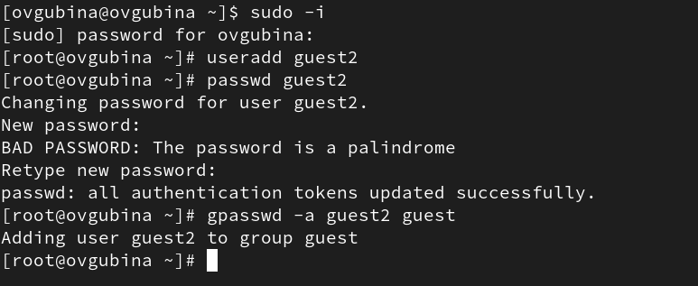{#fig:001 width=70%}

2. Зададим пароль для пользователя guest (использую учётную запись администратора) (рис. @fig:001): ```passwd guest```.

3. Добавила пользователя guest2 в группу guest: `gpasswd -a guest2 guest` (рис. @fig:010).

4. Зашли под обоих пользователей. Определим директорию, в которой находимся на обоих пользователях, командой ```pwd```(рис. @fig:002-@fig:003). Сравниv её с приглашением командной строки. В командной строке видим символ ```~```, что свидетельствует о том, что мы находимся в домашней директории. Определим, является ли она действительно домашней директорией, введя команду ```cd```, которая позволяет перейти в домашнюю директорию. Видим, что ничего не меняется. **Мы находимся в своей домашней директории.**

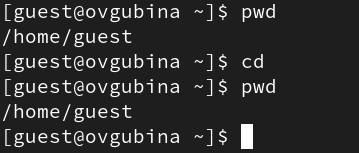{#fig:002 width=70%}

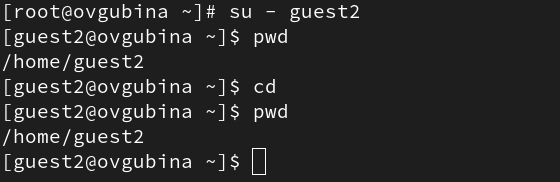{#fig:003 width=70%}

5. Уточним имя пользователя командой ```whoami``` (рис. @fig:004).

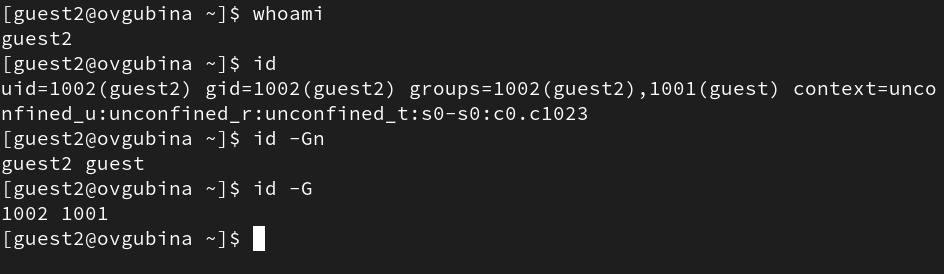{#fig:004 width=70%}

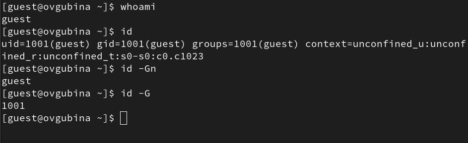{#fig:005 width=70%}

Команда ```whoami``` дала нам понять, что имя пользователя - **guest** и **guest2**. В начале приглашения командной строки как раз указано имя нашего пользователя - все сходится.

6. Уточним имя пользователя, его группу, а также группы, куда входит пользователь, командой ```id``` (рис. @fig:004). 

Видим следующие данные: uid = 1001(guest), gid = 1001(guest), groups = 1001(guest) - для guest (рис. @fig:005); uid = 1002(guest2), gid = 1002(guest2), groups = 1002(guest2),1001(guest) - для guest2 (рис. @fig:004).

Также рассматриваются команды `id -Gn` - показывает названия групп пользователя, `id -G` - id групп пользователя (рис. @fig:004-@fig:005).

Сравним вывод id с выводом команды ```groups``` (рис. @fig:006-@fig:007).

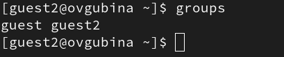{#fig:006 width=70%}

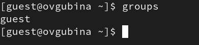{#fig:007 width=70%}

Данная команда показывает группы текущего пользователя, аналогично выводу команды ```id```.

8. Просмотрим файл /etc/passwd (рис. @fig:008):

```
cat /etc/passwd
```

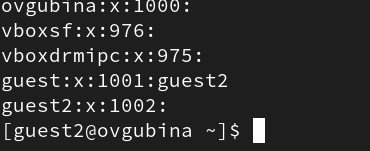{#fig:008 width=70%}

Найдем в нем предпоследнюю запись - запись о группе guest (рис. @fig:008). Данная строка показывает, что guest имеет gid = 1001 и в ней состоит пользвоатель guest2 (кроме пользователя владельца guest - он тут не показывается). 

Последняя строка - группа gues2 имеющая gid = 1002, список пользователей в ней пуст, т.к. в ней состоит только владелец guest2.

9. От имени пользователя guest2 выполните регистрацию пользователя guest2 в группе guest командой `newgrp guest` (@fig:009).

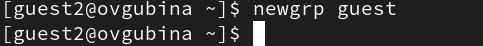{#fig:009 width=70%}

10. От имени пользователя guest измените права директории /home/guest, разрешив все действия для пользователей группы: `chmod g+rwx /home/guest` (рис. @fig:010).

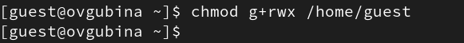{#fig:010 width=70%}

11. От имени пользователя guest снимите с директории /home/guest/dir1
все атрибуты командой  `chmod 000 dirl` (рис. @fig:011).

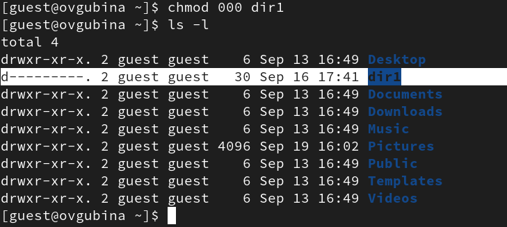{#fig:011 width=70%}

Проверим правильность выполнения с помощью команды ```ls -l``` (рис. @fig:011).

Видим, что теперь на директорию dir1 нет никаких прав.

14. Заполните таблицу «Установленные права и разрешённые действия для групп», выполняя действия от имени владельца директории (файлов), определив опытным путём, какие операции разрешены, а какие нет. Если операция разрешена, занесите в таблицу знак «+», если не разрешена, знак «-».

Для опрделения опытным путем будем использовать следующие действияв соответствие со столбцами таблицы:

- ```cd dir1``` - смена директории;
- ```touch <новый_файл>``` - создание файла;
- ```rm <новый_файл>``` - удаление файла;
- ```ls -l (dir1)``` - просмотр файлов в директории;
- ```echo "test" > <файл_с_установленными_правами>``` - запись в файл;
- ```cat <файл_с_установленными_правами>``` - чтение файла;
- ```mv <файл_с_установленными_правами> <переименование>``` - переименование файла;
- ```chattr <атрибуты> <файл_с_установленными_правами>``` смена атрибутов файла.

В качесвте примера приведу осуществление проверки для прав доступа ```d---rwx--- (070), ----------(000)``` (рис. @fig:012), ```d---rwx--- (070), ------x---(010)```  (рис. @fig:013), ```d---rwx--- (070), -----w----(020)``` (рис. @fig:014), ```d---rwx--- (070), -----wx---(030)``` (рис. @fig:015), ```d---rwx--- (070), ----r-----(400)``` (рис. @fig:016), ```d---rwx--- (070), ----r-x---(050)``` (рис. @fig:017), ```d---rwx--- (070), ----rw----(060)``` (рис. @fig:018), ```d---rwx--- (070), ----rwx---(070)``` (рис. @fig:019).

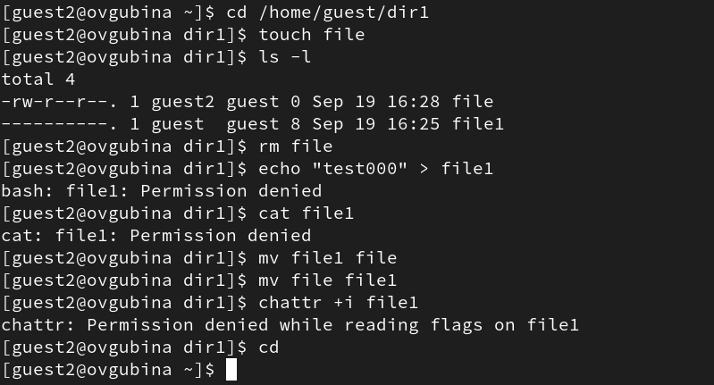{#fig:012 width=70%}

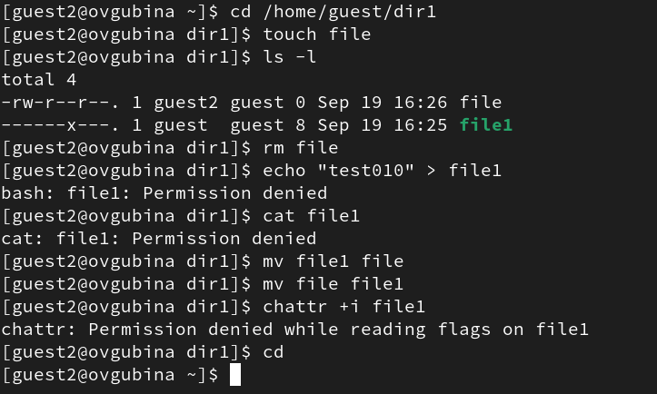{#fig:013 width=70%}

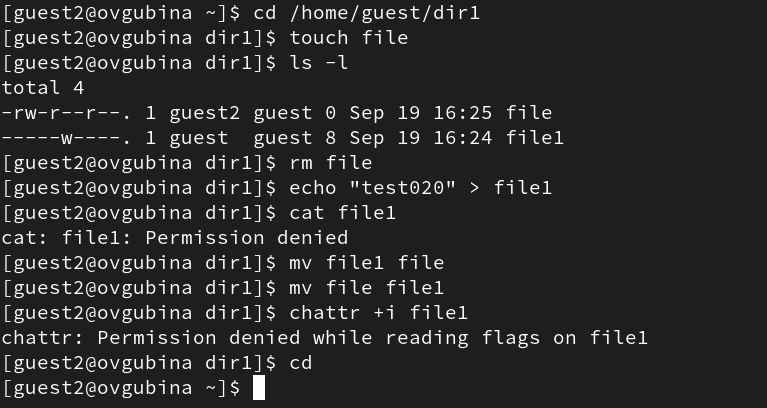{#fig:014 width=70%}

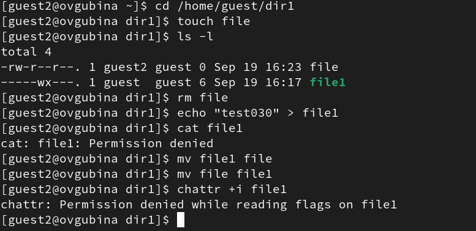{#fig:015 width=70%}

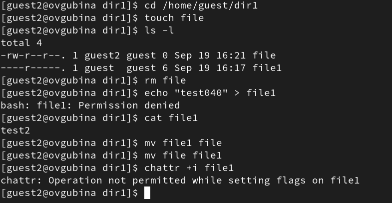{#fig:016 width=70%}

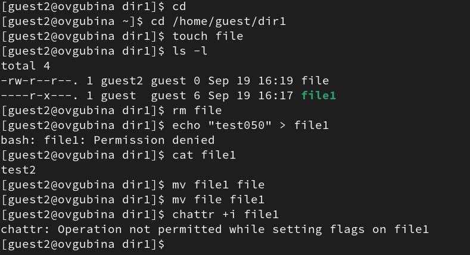{#fig:017 width=70%}

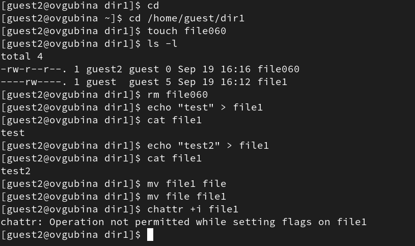{#fig:018 width=70%}

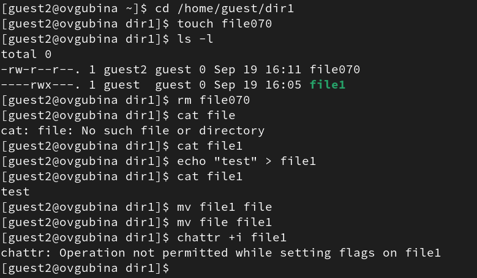{#fig:019 width=70%}

Заполненная табл. @tbl:01 краткого описания стандартных каталогов Unix.

: Установленные права и разрешенные действия для групп {#tbl:01}

|Права директории|Права файла|Создание файла|Удаление файла|Запись в файл|Чтение файла|Смена директории|Просмотр файлов директории|Переименование файла|Смена аттрибутов файла|
|------------------|-------------|-------|-----|------|-------|------------|-----------|---------|------------|
|```---------``` (000)|```---------``` (000)| - | - | - | - | - | - | - | - |
|```---------``` (000)|```-----x---``` (010)| - | - | - | - | - | - | - | - |
|```---------``` (000)|```----w----``` (020)| - | - | - | - | - | - | - | - |
|```---------``` (000)|```----wx---``` (030)| - | - | - | - | - | - | - | - |
|```---------``` (000)|```---r-----``` (040)| - | - | - | - | - | - | - | - |
|```---------``` (000)|```---r-x---``` (050)| - | - | - | - | - | - | - | - |
|```---------``` (000)|```---rw----``` (060)| - | - | - | - | - | - | - | - |
|```---------``` (000)|```---rwx---``` (070)| - | - | - | - | - | - | - | - |
|```-----x---``` (010)|```---------``` (000)| - | - | - | - | + | - | - | - |
|```-----x---``` (010)|```-----x---``` (010)| - | - | - | - | + | - | - | - |
|```-----x---``` (010)|```----w----``` (020)| - | - | + | - | + | - | - | - |
|```-----x---``` (010)|```----wx---``` (030)| - | - | + | - | + | - | - | - |
|```-----x---``` (010)|```---r-----``` (040)| - | - | - | + | + | - | - | + |
|```-----x---``` (010)|```---r-x---``` (050)| - | - | - | + | + | - | - | + |
|```-----x---``` (010)|```---rw----``` (060)| - | - | + | + | + | - | - | + |
|```-----x---``` (010)|```---rwx---``` (070)| - | - | + | + | + | - | - | + |
|```----w----``` (020)|```---------``` (000)| - | - | - | - | - | - | - | - |
|```----w----``` (020)|```-----x---``` (010)| - | - | - | - | - | - | - | - |
|```----w----``` (020)|```----w----``` (020)| - | - | - | - | - | - | - | - |
|```----w----``` (020)|```----wx---``` (030)| - | - | - | - | - | - | - | - |
|```----w----``` (020)|```---r-----``` (040)| - | - | - | - | - | - | - | - |
|```----w----``` (020)|```---r-x---``` (050)| - | - | - | - | - | - | - | - |
|```----w----``` (020)|```---rw----``` (060)| - | - | - | - | - | - | - | - |
|```----w----``` (020)|```---rwx---``` (070)| - | - | - | - | - | - | - | - |
|```----wx---``` (030)|```---------``` (000)| + | + | - | - | + | - | + | - |
|```----wx---``` (030)|```-----x---``` (010)| + | + | - | - | + | - | + | - |
|```----wx---``` (030)|```----w----``` (020)| + | + | + | - | + | - | + | - |
|```----wx---``` (030)|```----wx---``` (030)| + | + | + | - | + | - | + | - |
|```----wx---``` (030)|```---r-----``` (040)| + | + | - | + | + | - | + | + |
|```----wx---``` (030)|```---r-x---``` (050)| + | + | - | + | + | - | + | + |
|```----wx---``` (030)|```---rw----``` (060)| + | + | + | + | + | - | + | + |
|```----wx---``` (030)|```---rwx---``` (070)| + | + | + | + | + | - | + | + |
|```---r-----``` (040)|```---------``` (000)| - | - | - | - | - | + | - | - |
|```---r-----``` (040)|```-----x---``` (010)| - | - | - | - | - | + | - | - |
|```---r-----``` (040)|```----w----``` (020)| - | - | - | - | - | + | - | - |
|```---r-----``` (040)|```----wx---``` (030)| - | - | - | - | - | + | - | - |
|```---r-----``` (040)|```---r-----``` (040)| - | - | - | - | - | + | - | - |
|```---r-----``` (040)|```---r-x---``` (050)| - | - | - | - | - | + | - | - |
|```---r-----``` (040)|```---rw----``` (060)| - | - | - | - | - | + | - | - |
|```---r-----``` (040)|```---rwx---``` (070)| - | - | - | - | - | + | - | - |
|```---r-x---``` (050)|```---------``` (000)| - | - | - | - | + | + | - | - |
|```---r-x---``` (050)|```-----x---``` (010)| - | - | - | - | + | + | - | - |
|```---r-x---``` (050)|```----w----``` (020)| - | - | + | - | + | + | - | - |
|```---r-x---``` (050)|```----wx---``` (030)| - | - | + | - | + | + | - | - |
|```---r-x---``` (050)|```---r-----``` (040)| - | - | - | + | + | + | - | + |
|```---r-x---``` (050)|```---r-x---``` (050)| - | - | - | + | + | + | - | + |
|```---r-x---``` (050)|```---rw----``` (060)| - | - | + | + | + | + | - | + |
|```---r-x---``` (050)|```---rwx---``` (070)| - | - | + | + | + | + | - | + |
|```---rw----``` (060)|```---------``` (000)| - | - | - | - | - | + | - | - |
|```---rw----``` (060)|```-----x---``` (010)| - | - | - | - | - | + | - | - |
|```---rw----``` (060)|```----w----``` (020)| - | - | - | - | - | + | - | - |
|```---rw----``` (060)|```----wx---``` (030)| - | - | - | - | - | + | - | - |
|```---rw----``` (060)|```---r-----``` (040)| - | - | - | - | - | + | - | - |
|```---rw----``` (060)|```---r-x---``` (050)| - | - | - | - | - | + | - | - |
|```---rw----``` (060)|```---rw----``` (060)| - | - | - | - | - | + | - | - |
|```---rw----``` (060)|```---rwx---``` (070)| - | - | - | - | - | + | - | - |
|```---rwx---``` (070)|```---------``` (000)| + | + | - | - | + | + | + | - |
|```---rwx---``` (070)|```-----x---``` (010)| + | + | - | - | + | + | + | - |
|```---rwx---``` (070)|```----w----``` (020)| + | + | + | - | + | + | + | - |
|```---rwx---``` (070)|```----wx---``` (030)| + | + | + | - | + | + | + | - |
|```---rwx---``` (070)|```---r-----``` (040)| + | + | - | + | + | + | + | + |
|```---rwx---``` (070)|```---r-x---``` (050)| + | + | - | + | + | + | + | + |
|```---rwx---``` (070)|```---rw----``` (060)| + | + | + | + | + | + | + | + |
|```---rwx---``` (070)|```---rwx---``` (070)| + | + | + | + | + | + | + | + |

15. На основании заполненной таблицы @tbl:01 определите те или иные минимально необходимые права для выполнения операций внутри директории dir1, заполните табл. @tbl:02.

: Минимальные права для совершения операций для пользователей, входящих в группу {#tbl:02}

|Операция                |Минимальные права на директорию|Минимальные права на файл|
|------------------------|-------------------------------|-------------------------|
|Создание файла          |`d----wx---(030)`              |`----------(000)`        |
|Удаление файла          |`d----wx---(030)`              |`----------(000)`        |
|Чтение файла            |`d-----x---(010)`              |`----r-----(040)`        |
|Запись в файл           |`d-----x---(010)`              |`-----w----(020)`        |
|Переименование файла    |`d----wx---(030)`              |`----------(000)`        |
|Создание поддиректории  |`d----wx---(030)`              |`----------(000)`        |
|Удаление поддиректории  |`d----wx---(030)`              |`----------(000)`        |


# Выводы

Получила практические навыки работы в консоли с атрибутами файлов для групп пользователей.


# Список литературы{.unnumbered}

::: {#refs}
:::
