---
## Front matter
lang: ru-RU
title: Лабораторная работа №4
subtitle: Дискреционное разграничение прав в Linux. Расширенные атрибуты

author:
  - Губина О. В.
institute:
  - Российский университет дружбы народов, Москва, Россия
date: 27 сентября 2023

## i18n babel
babel-lang: russian
babel-otherlangs: english

## Formatting pdf
toc: false
toc-title: Содержание
slide_level: 2
aspectratio: 169
section-titles: true
theme: metropolis
header-includes:
 - \metroset{progressbar=frametitle,sectionpage=progressbar,numbering=fraction}
 - '\makeatletter'
 - '\beamer@ignorenonframefalse'
 - '\makeatother'
---

# Информация

## Докладчик

  * Губина Ольга Вячеславовна
  * студент(-ка) уч. группы НПИбд-01-20
  * Российский университет дружбы народов
  * [1032201737@pfur.ru](mailto:1032201737@rudn.ru)
  * <https://github.com/ovgubina>

# Вводная часть

## Актуальность

- Необходимость понимания возможножностей, предоставляемых различными правами и атрибутами доступа для пользователей. 

## Объект и предмет исследования

- Расширенные атрибуты файлов **a** и **i**.

## Цели и задачи

- Получить практические навыки работы в консоли с расширенными атрибутами файлов.
- Изучить на практике действие расширенных атрибутов **a** и **i**.

## Материалы и методы

- Командная строка ОС Linux

# Процесс выполнения работы

## Подготовка файла file1

:::::::::::::: {.columns align=center}
::: {.column width="50%"}

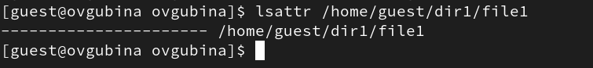

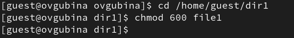

:::
::: {.column width="50%"}

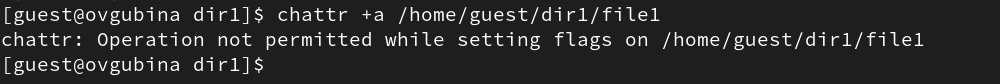
:::
::::::::::::::

## Добавление расширенного атрибута a  

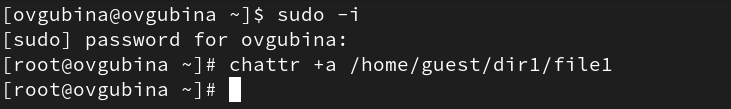

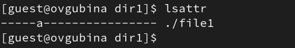

## Проверка возможностей 

:::::::::::::: {.columns align=center}
::: {.column width="50%"}

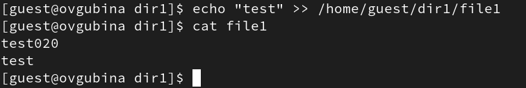

:::
::: {.column width="50%"}

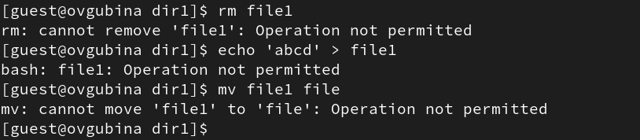

:::
::::::::::::::

## Изменение прав доступа

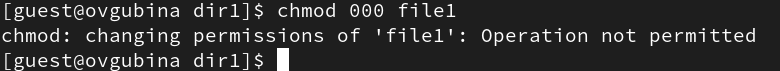

## Удаление атрибута a

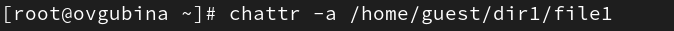

## Осуществление команд после удаления атрибута

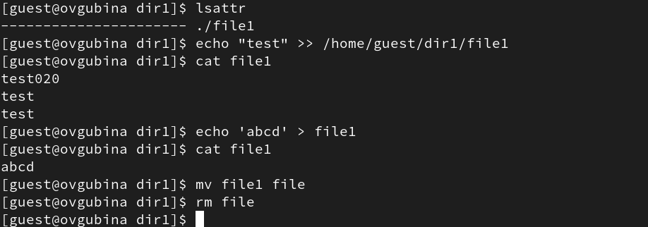

## Подготовка нового файла

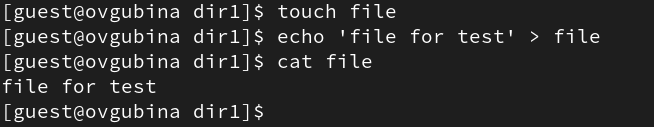

## Добавление расширенного атрибута i  

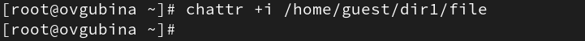

## Проверка возможностей 

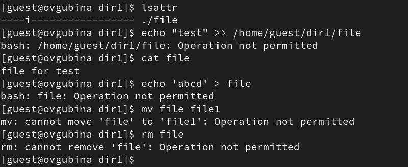

## Удаление атрибута i

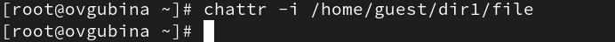

## Осуществление команд после удаления атрибута

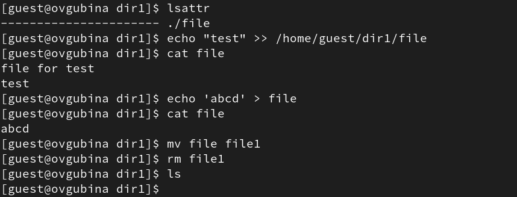

# Результаты работы

- Произвела работу в консоли с атрибутами;
- Получила практические навыки работы в консоли с расширенными атрибутами файлов.
- Изучила на практике действие расширенных атрибутов **a** и **i**.

# Вывод

Получила практические навыки работы в консоли с атрибутами файлов, закрепила теоретические основы дискреционного разграничения доступа в современных системах с открытым кодом на базе ОС Linux. Изучила на практике действие расширенных атрибутов **a** и **i**.

[def]: ttps://github.com/ovgubina