---
## Front matter
title: "Лабораторная работа №4"
subtitle: "Дисциплина: Информационная безопасность"
author: "Губина Ольга Вячеслвовна"

## Generic otions
lang: ru-RU
toc-title: "Содержание"

## Bibliography
bibliography: bib/cite.bib
csl: pandoc/csl/gost-r-7-0-5-2008-numeric.csl

## Pdf output format
toc: true # Table of contents
toc-depth: 2
lof: true # List of figures
lot: true # List of tables
fontsize: 12pt
linestretch: 1.5
papersize: a4
documentclass: scrreprt
## I18n polyglossia
polyglossia-lang:
  name: russian
  options:
	- spelling=modern
	- babelshorthands=true
polyglossia-otherlangs:
  name: english
## I18n babel
babel-lang: russian
babel-otherlangs: english
## Fonts
mainfont: PT Serif
romanfont: PT Serif
sansfont: PT Sans
monofont: PT Mono
mainfontoptions: Ligatures=TeX
romanfontoptions: Ligatures=TeX
sansfontoptions: Ligatures=TeX,Scale=MatchLowercase
monofontoptions: Scale=MatchLowercase,Scale=0.9
## Biblatex
biblatex: true
biblio-style: "gost-numeric"
biblatexoptions:
  - parentracker=true
  - backend=biber
  - hyperref=auto
  - language=auto
  - autolang=other*
  - citestyle=gost-numeric
## Pandoc-crossref LaTeX customization
figureTitle: "Рис."
tableTitle: "Таблица"
listingTitle: "Листинг"
lofTitle: "Список иллюстраций"
lotTitle: "Список таблиц"
lolTitle: "Листинги"
## Misc options
indent: true
header-includes:
  - \usepackage{indentfirst}
  - \usepackage{float} # keep figures where there are in the text
  - \floatplacement{figure}{H} # keep figures where there are in the text
---

# Цель работы

Получение практических навыков работы в консоли с расширенными атрибутами файлов.

# Задание

- Изучить на практике действие расширенных атрибутов «а» и «i».

# Теоретическое введение

В данной лабораторной работе нам предстоит поработать с правами доступа файлов и директорий. **Права доступа** определяют, какие действия конкретный пользователь может или не может совершать с определенным файлами и каталогами.

Есть 3 вида разрешений. Они определяют права пользователя на 3 действия: чтение, запись и выполнение. В Linux эти действия обозначаются вот так:

- **r** — read (чтение) — право просматривать содержимое файла;
- **w** — write (запись) — право изменять содержимое файла;
- **x** — execute (выполнение) — право запускать файл, если это программа или скрипт.

У каждого файла есть 3 группы пользователей, для которых можно устанавливать права доступа. 

- **owner** (владелец) — отдельный человек, который владеет файлом. Обычно это тот, кто создал файл, но владельцем можно сделать и кого-то другого.
- **group** (группа) — пользователи с общими заданными правами.
- **others** (другие) — все остальные пользователи, не относящиеся к группе и не являющиеся владельцами.[@01] 

Чтобы увидеть текущие назначения владельца, вы можете использовать команду ```ls -l```. Эта команда показывает пользователя и группу-владельца.

С помощью команды `ls` вы можете отобразить владельца файлов в данном каталоге. Иногда может оказаться полезным получить список всех файлов в системе, в которых в качестве владельца указан данный пользователь или группа. Для этого вы можете использовать find. Аргумент find -user может быть использован для этой цели.

Чтобы применить соответствующие разрешения, первое, что нужно учитывать, это владение. Для этого есть команда ```chown```.[@02]

Для того, чтобы позволить обычным пользователям выполнять программы от имени суперпользователя без знания его пароля была придумана такая вещь, как SUID и SGID биты. Рассмотрим эти полномочия подробнее.

- **SUID** - если этот бит установлен, то при выполнении программы, id пользователя, от которого она запущена заменяется на id владельца файла. Фактически, это позволяет обычным пользователям запускать программы от имени суперпользователя;
- **SGID** - этот флаг работает аналогичным образом, только разница в том, что пользователь считается членом группы, с которой связан файл, а не групп, к которым он действительно принадлежит. Если SGID флаг установлен на каталог, все файлы, созданные в нем, будут связаны с группой каталога, а не пользователя. Такое поведение используется для организации общих папок;
- **Sticky-bit** - этот бит тоже используется для создания общих папок. Если он установлен, то пользователи могут только создавать, читать и выполнять файлы, но не могут удалять файлы, принадлежащие другим пользователям.[@03]

`chattr` изменяет атрибуты файлов в файловой системе Linux.

Формат символьного режима: **+-=[aAcCdDeFijmPsStTux]**.

Оператор «+» вызывает добавление выбранных атрибутов к существующим атрибутам файлов; «-» заставляет их удалить; и «=» делает их единственными атрибутами файлов.

Буквы «aAcCdDeFijmPsStTux» выбирают **новые атрибуты для файлов**[@04]:

- только добавление (a),
- без обновлений времени (A),
- сжатие (c),
- без копирования при записи (C),
- без дампа (d),
- синхронные обновления каталогов (D),
- формат экстента (e),
- поиск в каталогах без учёта регистра (F),
- неизменяемый (i),
- ведение журнала данных (j),
- без сжатия (m),
- иерархия проекта (P),
- безопасное удаление (s),
- синхронные обновления (S),
- без слияния хвостов (t),
- вершина иерархии каталогов (T),
- возможность восстановления после удаления (u)
- прямой доступ к файлам (x).

# Выполнение лабораторной работы

1. От имени пользователя guest определите расширенные атрибуты файла `/home/guest/dir1/file1` командой `lsattr /home/guest/dir1/file1` (рис. @fig:01).

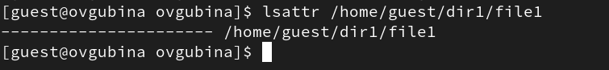{#fig:01 width=70%}

2. Установите командой `chmod 600 file1` на файл **file1** права, разрешающие чтение и запись для владельца файла (рис. @fig:02).

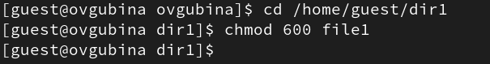{#fig:02 width=70%}

3. Попробуйте установить на файл **/home/guest/dir1/file1** расширенный атрибут a от имени пользователя **guest** (рис. @fig:03):

```
chattr +a /home/guest/dir1/file1
```

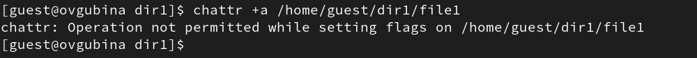{#fig:03 width=70%}

В ответ мы получили отказ от выполнения операции.

4. Зайдем в консоль с правами администратора (рис. @fig:04). Попробуйте установить расширенный атрибут a на файл `/home/guest/dir1/file1` от имени суперпользователя (рис. @fig:04):

```
chattr +a /home/guest/dir1/file1
```

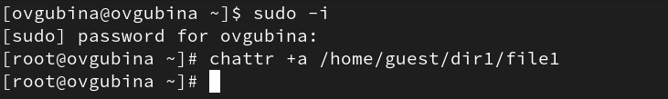{#fig:04 width=70%}

Установка разрешена.

5. От пользователя **guest** проверьте правильность установления атрибута: `lsattr /home/guest/dir1/file1` (рис. @fig:05)

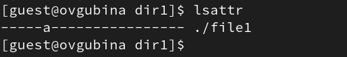{#fig:05 width=70%}

6. Выполните дозапись в файл **file1** слова «test» командой `echo "test" >> /home/guest/dir1/file1` (рис. @fig:06).

После этого выполните чтение файла **file1** командой `cat /home/guest/dir1/file1` (рис. @fig:06).
Убедитесь, что слово test было успешно записано в file1 командой `cat file1`.

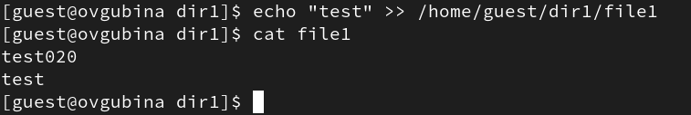{#fig:06 width=70%}

Мы можем это сделать, при просмотре файла видно, что дозапись была произведена успешно.

Дозапись возможна потому, что атрибут а позволяет добавлять что-либо в файл, но менять уже имеющуюся информацию с таким атрибутом нельзя.

7. Попробуйте удалить файл **file1** `rm file1` либо стереть имеющуюся в нём информацию командой `echo "abcd" > /home/guest/dirl/file1` (рис. @fig:07).
Попробуйте переименовать файл `mv file1 file` (рис. @fig:07).

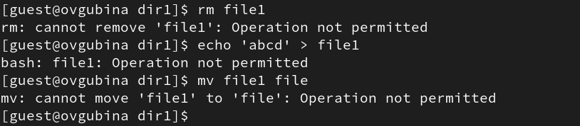{#fig:07 width=70%}

Видим, что мы не мможем сделать ничего из вышеперечисленного, поскольку атрибут не позволяет нам изменять имеющуюся информацию о файле.

8. Попробуйте с помощью команды `chmod 000 file1` установить на файл **file1** права, запрещающие чтение, выполнение и запись для владельца файла (рис. @fig:08). Удалось ли вам успешно выполнить указанные команды?

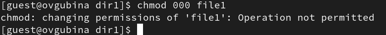{#fig:08 width=70%}

Мы не можем поменять разрешения файла с данным атрибутом.

9. Снимите расширенный атрибут `a` с файла **/home/guest/dirl/file1** от имени суперпользователя командой `chattr -a /home/guest/dir1/file1` (рис. @fig:09). После этого выполним опрации, неудавшиеся ранее (рис. @fig:10).

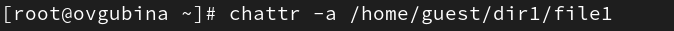{#fig:09 width=70%}

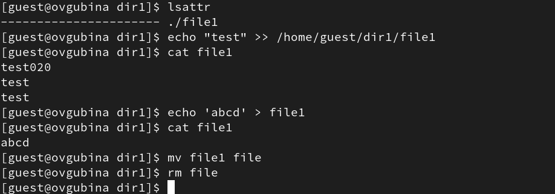{#fig:10 width=70%}

Видим, что теперь мы можем произвести дозапись, запись, переименование и удаление файла.

Разрешения файла поменять возможно.

10. Повторите ваши действия по шагам, заменив атрибут «a» атрибутом «i».
Удалось ли вам дозаписать информацию в файл? Ваши наблюдения занесите в отчёт.
В результате выполнения работы вы повысили свои навыки использования интерфейса командой строки (CLI), познакомились на примерах с тем,
как используются основные и расширенные атрибуты при разграничении
доступа. Имели возможность связать теорию дискреционного разделения
доступа (дискреционная политика безопасности) с её реализацией на практике в ОС Linux. Составили наглядные таблицы, поясняющие какие операции возможны при тех или иных установленных правах. Опробовали действие на практике расширенных атрибутов «а» и «i».

Для этого сперва создадим файл, удаленный ранее - **file**, и запишем в него какую-то информацию, для проверки (рис. @fig:11).

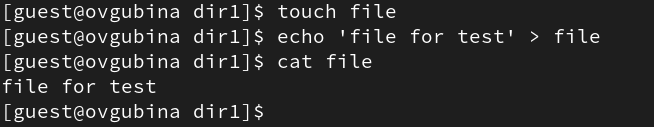{#fig:11 width=70%}

После этого присвоим файлу расширенный атрибут **i**, который делает файл полностью неизменяемым (рис. @fig:12).

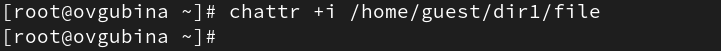{#fig:12 width=70%}

Заново проделаем вышеперечисленные команды (рис. @fig:13). 

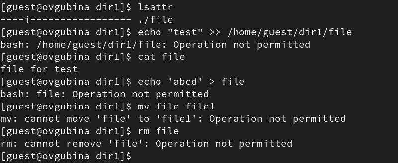{#fig:13 width=70%}

Видим, что мы не можем произвести ни одно из выполненных действий, а именно: дозапись в файл, запись в файл, изменение имени файла, удаление.

Удалим атрибут **i** из списка расширенных атрибутов файла (рис. @fig:14).

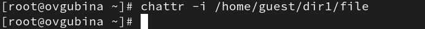{#fig:14 width=70%}

И снова прделаем операции (рис. @fig:15).

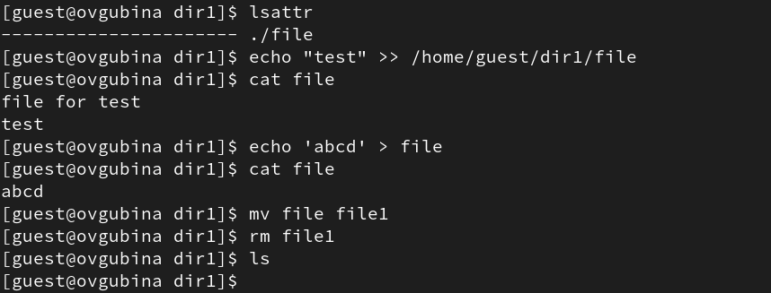{#fig:15 width=70%}

Видим, что теперь мы можем успешно осуществить все команды, которые не удалоаь осуществить ранее.

# Выводы

В результате выполнения работы повысила свои навыки использования интерфейса командой строки (CLI), познакомились на примерах с тем,
как используются расширенные атрибуты. Опробовала действие на практике расширенных атрибутов «а» и «i».


# Список литературы{.unnumbered}

::: {#refs}
:::
