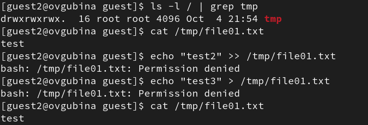

---
## Front matter
lang: ru-RU
title: Лабораторная работа №5
subtitle: Дискреционное разграничение прав в Linux. Исследование влияния дополнительных атрибутов

author:
  - Губина О. В.
institute:
  - Российский университет дружбы народов, Москва, Россия
date: 06 октября 2023

## i18n babel
babel-lang: russian
babel-otherlangs: english

## Formatting pdf
toc: false
toc-title: Содержание
slide_level: 2
aspectratio: 169
section-titles: true
theme: metropolis
header-includes:
 - \metroset{progressbar=frametitle,sectionpage=progressbar,numbering=fraction}
 - '\makeatletter'
 - '\beamer@ignorenonframefalse'
 - '\makeatother'
---

# Информация

## Докладчик

  * Губина Ольга Вячеславовна
  * студент(-ка) уч. группы НПИбд-01-20
  * Российский университет дружбы народов
  * [1032201737@pfur.ru](mailto:1032201737@rudn.ru)
  * <https://github.com/ovgubina>

# Вводная часть

## Актуальность

- Необходимость понимания возможножностей, предоставляемых различными правами и атрибутами доступа для пользователей. 

## Объект и предмет исследования

- Применение SetUID-, SetGID- и Sticky-битов.

## Цели и задачи

- Изучить на практике действие SetUID-, SetGID- и Sticky-битов.

## Материалы и методы

- Командная строка ОС Linux

# Процесс выполнения работы

## Создание программы simpleid.c

:::::::::::::: {.columns align=center}
::: {.column width="50%"}

:::
::: {.column width="50%"}

:::
::::::::::::::

## Выполнение программы simple.c  

## Программа simpleid2.c

:::::::::::::: {.columns align=center}
::: {.column width="50%"}

:::
::: {.column width="50%"}

:::
::::::::::::::

## Изменение прав доступа

## Выполнение программы simple2.c

## Назначение SetGID-бита

## Запуск программы

## Программа readfile.c

:::::::::::::: {.columns align=center}
::: {.column width="50%"}

:::
::: {.column width="50%"}

:::
::::::::::::::

## Смена прав доступа

## Добавление SetUID-бита

## Попытка чтения файла readfile.c

## Попытка чтения файла /etc/shadow

## Проверка наличия STICKY-бита на директории tmp и создание тестового файла

## Попытка дозаписи и записи в файл и его удалениие

{width=70%}

{width=70%}

## Удаление STICKY-бита

## Попытка дозаписи и записи в файл и его удаление

# Результаты работы

- Изучила на практике действие SetUID-, SetGID- и Sticky-битов.

# Вывод

Изучила механизмы изменения идентификаторов, применения SetUID- и Sticky-битов. Получила практические навыки работы в консоли с дополнительными атрибутами. Рассмотрела работы механизма смены идентификатора процессов пользователей, а также влияние бита Sticky на запись и удаление файлов.

[def]: ttps://github.com/ovgubina