---
## Front matter
title: "Лабораторная работа №5"
subtitle: "Дисциплина: Информационная безопасность"
author: "Губина Ольга Вячеслвовна"

## Generic otions
lang: ru-RU
toc-title: "Содержание"

## Bibliography
bibliography: bib/cite.bib
csl: pandoc/csl/gost-r-7-0-5-2008-numeric.csl

## Pdf output format
toc: true # Table of contents
toc-depth: 2
lof: true # List of figures
lot: true # List of tables
fontsize: 12pt
linestretch: 1.5
papersize: a4
documentclass: scrreprt
## I18n polyglossia
polyglossia-lang:
  name: russian
  options:
	- spelling=modern
	- babelshorthands=true
polyglossia-otherlangs:
  name: english
## I18n babel
babel-lang: russian
babel-otherlangs: english
## Fonts
mainfont: PT Serif
romanfont: PT Serif
sansfont: PT Sans
monofont: PT Mono
mainfontoptions: Ligatures=TeX
romanfontoptions: Ligatures=TeX
sansfontoptions: Ligatures=TeX,Scale=MatchLowercase
monofontoptions: Scale=MatchLowercase,Scale=0.9
## Biblatex
biblatex: true
biblio-style: "gost-numeric"
biblatexoptions:
  - parentracker=true
  - backend=biber
  - hyperref=auto
  - language=auto
  - autolang=other*
  - citestyle=gost-numeric
## Pandoc-crossref LaTeX customization
figureTitle: "Рис."
tableTitle: "Таблица"
listingTitle: "Листинг"
lofTitle: "Список иллюстраций"
lotTitle: "Список таблиц"
lolTitle: "Листинги"
## Misc options
indent: true
header-includes:
  - \usepackage{indentfirst}
  - \usepackage{float} # keep figures where there are in the text
  - \floatplacement{figure}{H} # keep figures where there are in the text
---

# Цель работы

Изучение механизмов изменения идентификаторов, применения SetUID- и Sticky-битов. Получение практических навыков работы в консоли с дополнительными атрибутами. Рассмотрение работы механизма смены идентификатора процессов пользователей, а также влияние бита Sticky на запись и удаление файлов.

# Задание

- Изучить на практике применение SetUID- и Sticky-битов.

# Теоретическое введение

**Setuid** – это бит разрешения, который позволяет пользователю запускать исполняемый файл с правами владельца этого файла. Другими словами, использование этого бита позволяет нам поднять привилегии пользователя в случае, если это необходимо. Классический пример использования этого бита в операционной системе это команда sudo.

Там, где обычно установлен классический бит **x** (на исполнение), выставляется специальный бит **s**. Это позволяет обычному пользователю системы выполнять команды с повышенными привилегиями без необходимости входа в систему как root, разумеется зная пароль пользователя root. Принцип работы **Setgid** очень похож на setuid с отличием, что файл будет запускаться пользователем от имени группы, которая владеет файлом.

Биты **setuid** и **setgid** выставляются с помощью команд `chmod u+s` и `chmod g+s` соответственно.[@01]

**Sticky-bit** — дополнительный атрибут файлов или каталогов в операционных системах семейства UNIX. В настоящее время sticky bit используется в основном для каталогов, чтобы защитить в них файлы. Из такого каталога пользователь может удалить только те файлы, владельцем которых он является. Примером может служить каталог /tmp, в который запись открыта для всех пользователей, но нежелательно удаление чужих файлов. Установка атрибута производится утилитой chmod.

В операционной системе Solaris для файлов, не являющихся программами, имеет строго противоположное действие — запрещает сохранение данных этого файла в системном кэше.[@02]

Это разрешение полезно для защиты файлов от случайного удаления в среде, где несколько пользователей имеют права на запись в один и тот же каталог. Если применяется закрепленный sticky bit, пользователь может удалить файл, только если он является пользователем-владельцем файла или каталога, в котором содержится файл. По этой причине он применяется в качестве разрешения по умолчанию для каталога /tmp и может быть полезен также для каталогов общих групп.

Когда вы применяете sticky bit, пользователь может удалять файлы, только если выполняется одно из следующих условий:

- Пользователь является владельцем файла;
- Пользователь является владельцем каталога, в котором находится файл.[@03]

# Выполнение лабораторной работы

Прежде чем начать выполнять работу, проверим, имеются ли на устройстве все необходимые ресурсы для осуществления компиляции (рис. @fig:01).

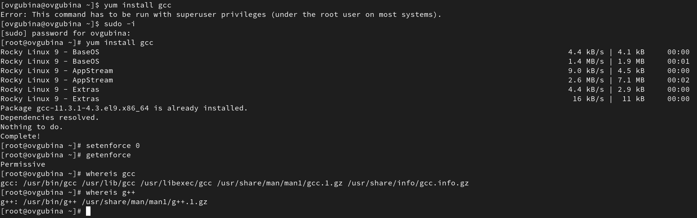{#fig:01 width=70%}

##  Создание программы

1. Войдите в систему от имени пользователя guest.
2. Создайте программу simpleid.c (рис. @fig:02-@fig:03):

``` 
#include <sys/types.h>
#include <unistd.h>
#include <stdio.h>
int
main ()
{
uid_t uid = geteuid ();
gid_t gid = getegid ();
printf ("uid=%d, gid=%d\n", uid, gid);
return 0;
}
```

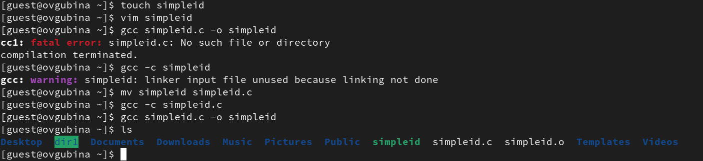{#fig:02 width=70%}

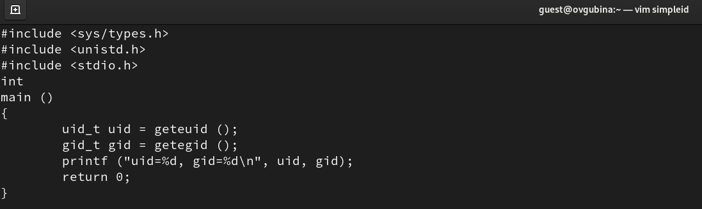{#fig:03 width=70%}

3. Скомплилируйте программу и убедитесь, что файл программы создан: `gcc simpleid.c -o simpleid` (рис. @fig:02).

Видим, что никаких ошибок при компиляции не возникает, файлы успешно созданы (проверка через команду `ls`).

4. Выполните программу simpleid (рис. @fig:04): `./simpleid`.

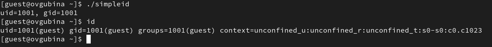{#fig:04 width=70%}

5. Выполните системную программу id (рис. @fig:04): `id`.
и сравните полученный вами результат с данными предыдущего пункта
задания.

Видим, что выводы программы, написанной ранее, и команды `id` совпадают - в каждой из них предоставляется информация об id владельца и группы, ими является guest с uid = 1001, gid = 1001.

6. Усложните программу, добавив вывод действительных идентификаторов (рис. @fig:06):

```
#include <sys/types.h>
#include <unistd.h>
#include <stdio.h>
int
main ()
{
uid_t real_uid = getuid ();
uid_t e_uid = geteuid ();
gid_t real_gid = getgid ();
gid_t e_gid = getegid () ;
printf ("e_uid=%d, e_gid=%d\n", e_uid, e_gid);
printf ("real_uid=%d, real_gid=%d\n", real_uid,
,→ real_gid);
return 0;
}
```

Получившуюся программу назовите simpleid2.c (рис. @fig:05).

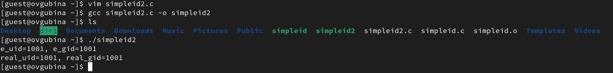{#fig:05 width=70%}

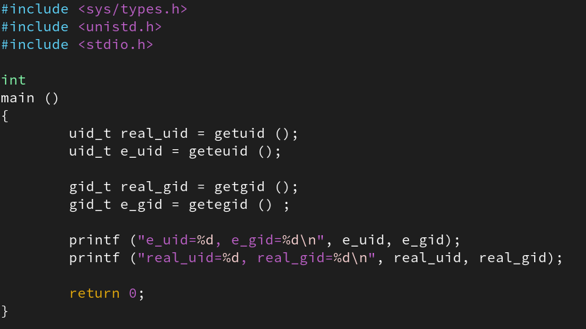{#fig:06 width=70%}

7. Скомпилируйте и запустите simpleid2.c (рис. @fig:05):

```
gcc simpleid2.c -o simpleid2
./simpleid2
```

Видим, что теперь выводятся айди владельца файла и айди текущего пользователя - сейчас это guest с uid = 1001, gid = 1001.

8. От имени суперпользователя выполните команды (рис. @fig:07):

```
chown root:guest /home/guest/simpleid2
chmod u+s /home/guest/simpleid2
```

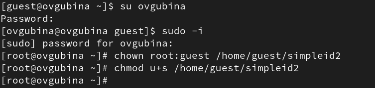{#fig:07 width=70%}

9. Используйте sudo или повысьте временно свои права с помощью su.
Поясните, что делают эти команды.

В данном случае я использвала sudo в дополнительном терминале.

Команды отличаются следующим: *su* требует пароль целевой учетной записи (например, пользователя root) и переключает вас на нее, в то время как sudo требует пароль текущего пользователя и запускает от его имени только лишь одну (или несколько) команд, на выполнение которых требуются права суперпользователя.

10. Выполните проверку правильности установки новых атрибутов и смены
владельца файла simpleid2 (рис. @fig:08): `ls -l simpleid2`

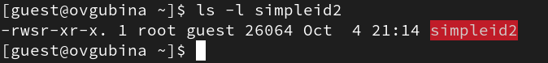{#fig:08 width=70%}

Видим добавленный SetUID-бит с правах доступа пользователя-владельца - **s**.

11. Запустите simpleid2 и id:

```
./simpleid2
id
```

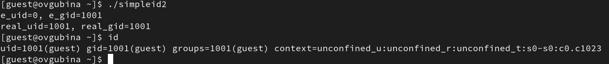{#fig:09 width=70%}

Видим, что теперь айди пользователя владельца - это айди пользователя root.

12. Проделайте тоже самое относительно SetGID-бита.

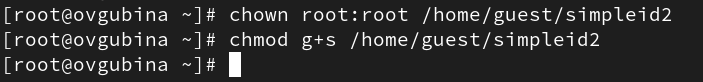{#fig:10 width=70%}

От пользвоателя guest смотрим назначение бита для группы - видим, что он добавился (рис. @fig:11). Запускаем программу и видим теперь поменявшееся айди группы пользователей на айди root (рис. @fig:11).

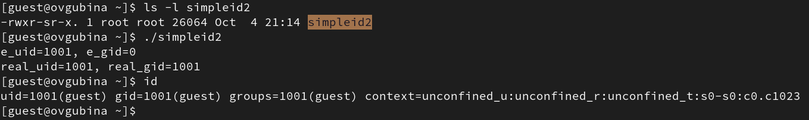{#fig:11 width=70%}

13. Создайте программу readfile.c (рис. @fig:13):

```
#include <fcntl.h>
#include <stdio.h>
#include <sys/stat.h>
#include <sys/types.h>
#include <unistd.h>
int
main (int argc, char* argv[])
{
unsigned char buffer[16];
size_t bytes_read;
int i;
int fd = open (argv[1], O_RDONLY);
do
{
bytes_read = read (fd, buffer, sizeof (buffer));
for (i =0; i < bytes_read; ++i) printf("%c", buffer[i]);
}
while (bytes_read == sizeof (buffer));
close (fd);
return 0;
}
```

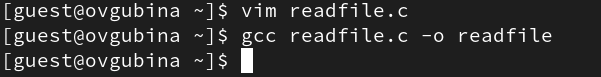{#fig:12 width=70%}

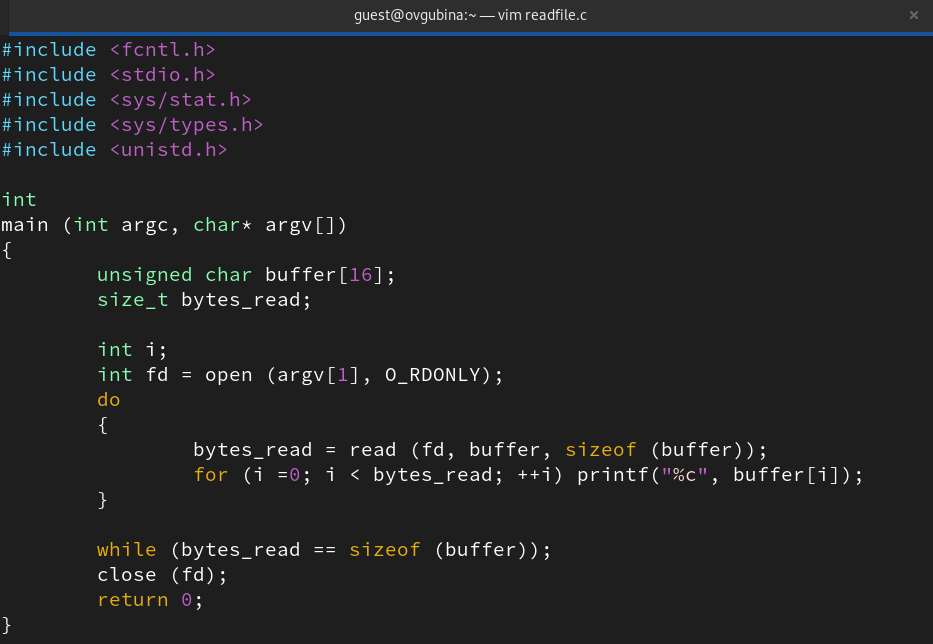{#fig:13 width=70%}

14. Откомпилируйте её (рис. @fig:13):

```
gcc readfile.c -o readfile
```

15. Смените владельца у файла readfile.c (или любого другого текстового
файла в системе) и измените права так, чтобы только суперпользователь
(root) мог прочитать его, a guest не мог.

Владельца файла меняем на root, назначаем права доступа 733 - дают полные права пользователю-владельцу и права на запись и выполнение остальным пользователям и группе (рис. @fig:14).

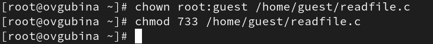{#fig:14 width=70%}

16. Проверьте, что пользователь guest не может прочитать файл readfile.c (рис. @fig:15).

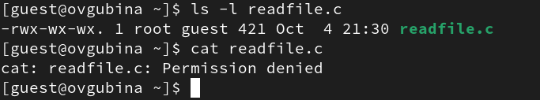{#fig:15 width=70%}

Пользователь действительно не может прочитать файл readfile.c - выводится сообщение **Permission denied**.

17. Смените у программы readfile владельца и установите SetUID-бит.

Меняем вадельца на root и назначаем SetUID-бит (рис. @fig:16).

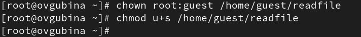{#fig:16 width=70%}

18. Проверьте, может ли программа readfile прочитать файл readfile.c (рис. @fig:16)?

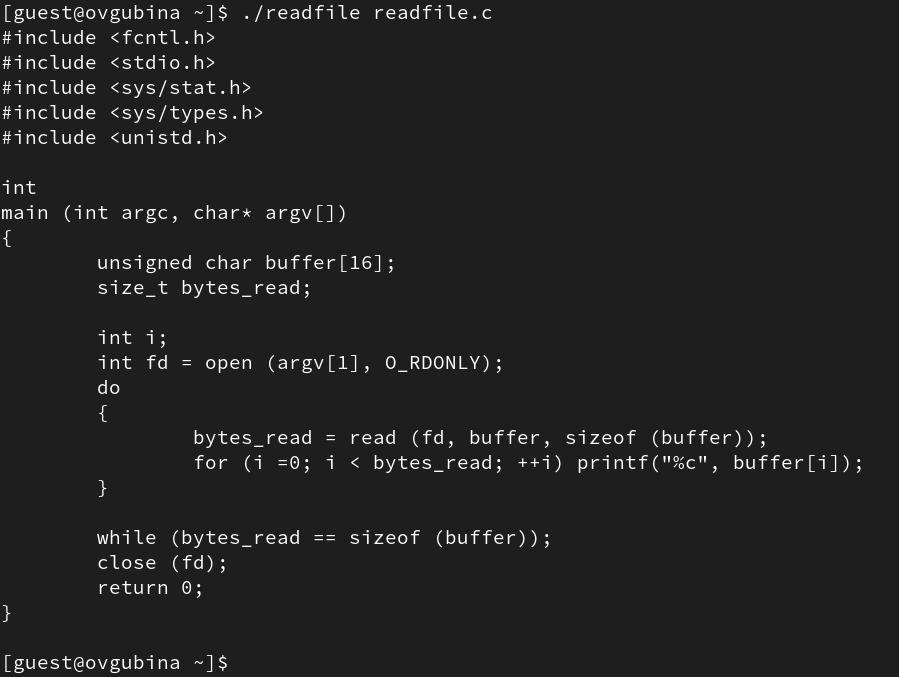{#fig:17 width=70%}

Нам удалось прочитать файл.

19. Проверьте, может ли программа readfile прочитать файл /etc/shadow?
Отразите полученный результат и ваши объяснения в отчёте.

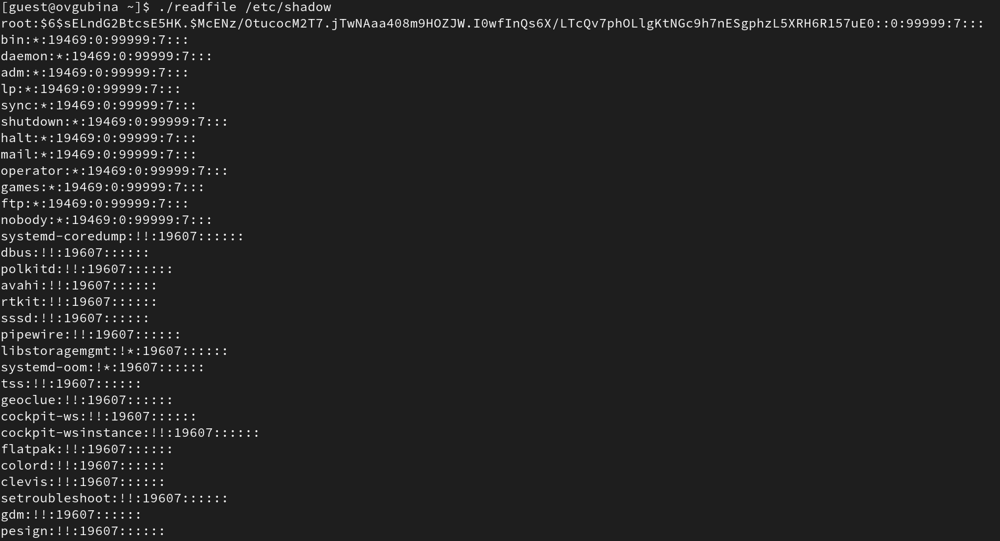{#fig:18 width=70%}

Нам удалось прочитать оба файла поскольку мы делали это с помощью программы readfile, которая принадлежит суперпользователю root.

## Исследование Sticky-бита

1. Выясните, установлен ли атрибут Sticky на директории /tmp, для чего
выполните команду `ls -l / | grep tmp` (рис. @fig:19).

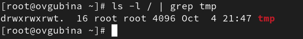{#fig:19 width=70%}

2. От имени пользователя guest создайте файл file01.txt в директории /tmp
со словом test: `echo "test" > /tmp/file01.txt` (рис. @fig:20)

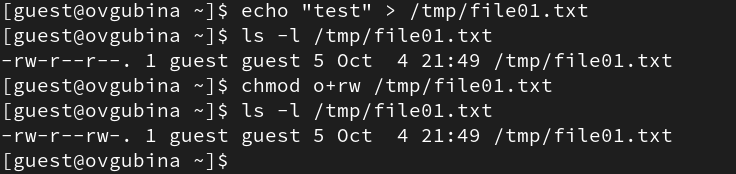{#fig:20 width=70%}

3. Просмотрите атрибуты у только что созданного файла и разрешите чтение и запись для категории пользователей «все остальные» (рис. @fig:20):

```
ls -l /tmp/file01.txt
chmod o+rw /tmp/file01.txt
ls -l /tmp/file01.txt
```

4. От пользователя guest2 (не являющегося владельцем) попробуйте прочитать файл /tmp/file01.txt: `cat /tmp/file01.txt` (рис. @fig:21).

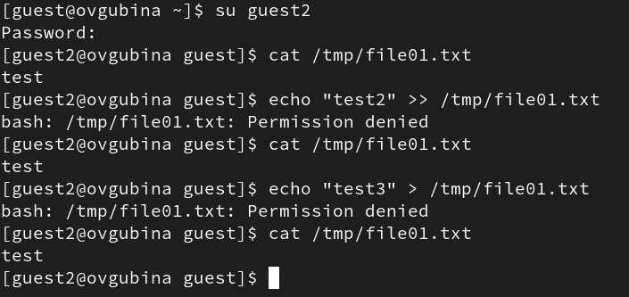{#fig:21 width=70%}

Содержимое файла выводится - можем прочитать файл.

5. От пользователя guest2 попробуйте дозаписать в файл /tmp/file01.txt слово test2 командой `echo "test2" >> /tmp/file01.txt` (рис. @fig:21). Удалось ли вам выполнить операцию?

Выполнить операцию не удалось - `Permission denied`.

6. Проверьте содержимое файла командой `cat /tmp/file01.txt` (рис. @fig:21).

Файл никак не изменился.

7. От пользователя guest2 попробуйте записать в файл /tmp/file01.txt слово test3, стерев при этом всю имеющуюся в файле информацию командой `echo "test3" > /tmp/file01.txt` (рис. @fig:21).
Удалось ли вам выполнить операцию?

Выполнить операцию не удалось - `Permission denied`.

8. Проверьте содержимое файла командой `cat /tmp/file01.txt` (рис. @fig:21).

Файл никак не изменился.

9. От пользователя guest2 попробуйте удалить файл /tmp/file01.txt командой `rm /tmp/fileOl.txt` (рис. @fig:24).
Удалось ли вам удалить файл?

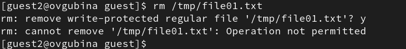{#fig:24 width=70%}

10. Повысьте свои права до суперпользователя следующей командой su - и выполните после этого команду, снимающую атрибут t (Sticky-бит) с директории /tmp: `chmod -t /tmp` (рис. @fig:22).

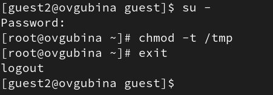{#fig:22 width=70%}

11. Покиньте режим суперпользователя командой `exit` (рис. @fig:22).

12. От пользователя guest2 проверьте, что атрибута **t** у директории /tmp
нет: `ls -l / | grep tmp` (рис. @fig:23)

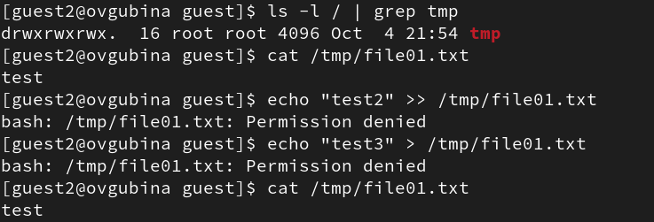{#fig:23 width=70%}

13. Повторите предыдущие шаги (рис. @fig:23). Какие наблюдаются изменения?

Изменений не наблюдается, мы также можем читать файл, но не можем производить дозапись и запись в него.

14. Удалось ли вам удалить файл от имени пользователя, не являющегося
его владельцем (рис. @fig:25)? Ваши наблюдения занесите в отчёт.

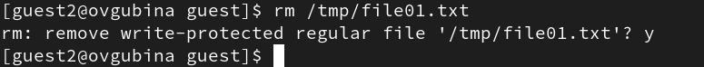{#fig:25 width=70%}

В жтот раз без Sticky-бита нам удалось успешно удалисть файл file01.txt.

15. Повысьте свои права до суперпользователя и верните атрибут t на директорию /tmp (рис. @fig:26):

```
su -
chmod +t /tmp
exit
```

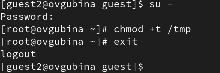{#fig:26 width=70%}

# Выводы

Изучила механизмы изменения идентификаторов, применения SetUID- и Sticky-битов. Получила практические навыки работы в консоли с дополнительными атрибутами. Рассмотрела работы механизма смены идентификатора процессов пользователей, а также влияние бита Sticky на запись и удаление файлов.

# Список литературы{.unnumbered}

::: {#refs}
:::
