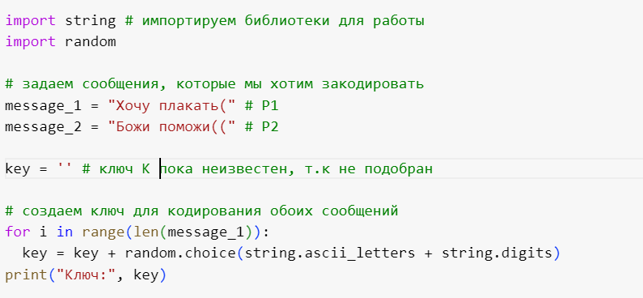
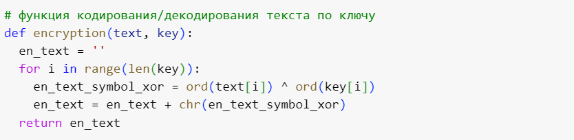
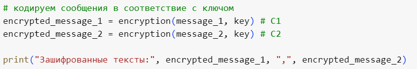
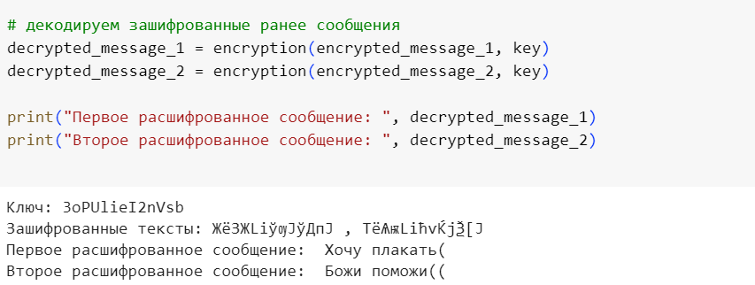
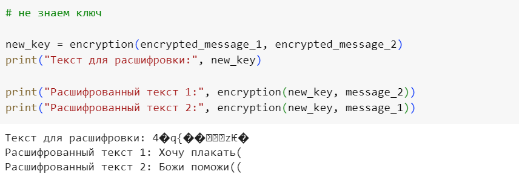

---
## Front matter
lang: ru-RU
title: Лабораторная работа №8
subtitle: Элементы криптографии. Шифрование (кодирование) различных исходных текстов одним ключом

author:
  - Губина О. В.
institute:
  - Российский университет дружбы народов, Москва, Россия
date: 28 октября 2023

## i18n babel
babel-lang: russian
babel-otherlangs: english

## Formatting pdf
toc: false
toc-title: Содержание
slide_level: 2
aspectratio: 169
section-titles: true
theme: metropolis
header-includes:
 - \metroset{progressbar=frametitle,sectionpage=progressbar,numbering=fraction}
 - '\makeatletter'
 - '\beamer@ignorenonframefalse'
 - '\makeatother'
---

# Информация

## Докладчик

  * Губина Ольга Вячеславовна
  * студент(-ка) уч. группы НПИбд-01-20
  * Российский университет дружбы народов
  * [1032201737@pfur.ru](mailto:1032201737@rudn.ru)
  * <https://github.com/ovgubina>

# Вводная часть

## Актуальность

- Необходимость знания шифрования на проктике для обеспечения информационной безопасности.

## Объект и предмет исследования

- Симметричное шифрование, гаммирование. 

## Цели и задачи

- Освоить на практике применение режима однократного гаммирования.
- Написать программу осуществляющую шифровние.

## Материалы и методы

- Язык программирования Python

# Процесс выполнения работы

## Создание сообщениий для кодирования и ключа

{width=70%}

## Функция кодирования

{width=70%}

## Шифрование сообщений

{width=70%}

## Дешифрование текста

{width=70%}

## Дешифрование без ключа

{width=70%}

# Результаты работы

- Написала программу программу осуществляющую кодирование двух текстов одним ключом (однократное гаммирование).

# Вывод

Освоила на практике применение режима однократного гаммирования для двух текстов при использовании одного ключа.

[def]: ttps://github.com/ovgubina