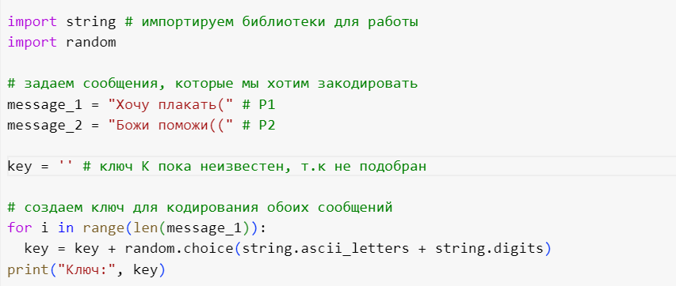
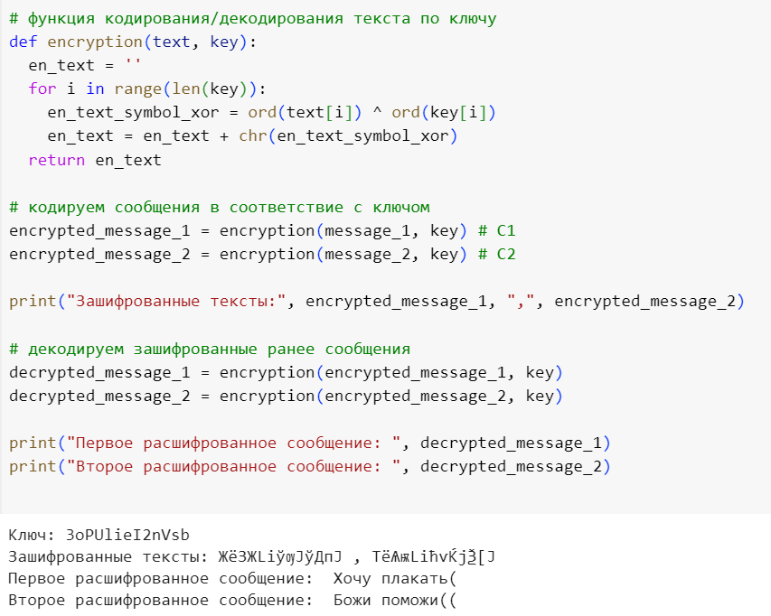
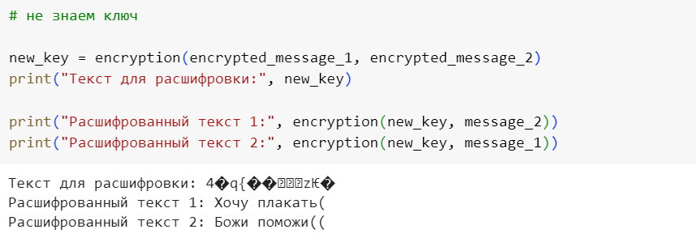

---
## Front matter
title: "Лабораторная работа №8"
subtitle: "Дисциплина: Информационная безопасность"
author: "Губина Ольга Вячеслвовна"

## Generic otions
lang: ru-RU
toc-title: "Содержание"

## Bibliography
bibliography: bib/cite.bib
csl: pandoc/csl/gost-r-7-0-5-2008-numeric.csl

## Pdf output format
toc: true # Table of contents
toc-depth: 2
lof: true # List of figures
lot: true # List of tables
fontsize: 12pt
linestretch: 1.5
papersize: a4
documentclass: scrreprt
## I18n polyglossia
polyglossia-lang:
  name: russian
  options:
	- spelling=modern
	- babelshorthands=true
polyglossia-otherlangs:
  name: english
## I18n babel
babel-lang: russian
babel-otherlangs: english
## Fonts
mainfont: PT Serif
romanfont: PT Serif
sansfont: PT Sans
monofont: PT Mono
mainfontoptions: Ligatures=TeX
romanfontoptions: Ligatures=TeX
sansfontoptions: Ligatures=TeX,Scale=MatchLowercase
monofontoptions: Scale=MatchLowercase,Scale=0.9
## Biblatex
biblatex: true
biblio-style: "gost-numeric"
biblatexoptions:
  - parentracker=true
  - backend=biber
  - hyperref=auto
  - language=auto
  - autolang=other*
  - citestyle=gost-numeric
## Pandoc-crossref LaTeX customization
figureTitle: "Рис."
tableTitle: "Таблица"
listingTitle: "Листинг"
lofTitle: "Список иллюстраций"
lotTitle: "Список таблиц"
lolTitle: "Листинги"
## Misc options
indent: true
header-includes:
  - \usepackage{indentfirst}
  - \usepackage{float} # keep figures where there are in the text
  - \floatplacement{figure}{H} # keep figures where there are in the text
---

# Цель работы

Освоить на практике применение режима однократного гаммирования на примере кодирования различных исходных текстов одним ключом.

# Задание

- Разработать приложение, позволяющее шифровать и дешифровать два текста в режиме однократного гаммирования.

# Теоретическое введение

**Гаммирование**, или Шифр XOR, — метод симметричного шифрования, заключающийся в «наложении» последовательности, состоящей из случайных чисел, на открытый текст. Последовательность случайных чисел называется гамма-последовательностью и используется для зашифровывания и расшифровывания данных. Суммирование обычно выполняется в каком-либо конечном поле. Например, в поле Галуа GF(2) суммирование принимает вид операции «исключающее ИЛИ (XOR)».[@01]

Шифры гаммирования (аддитивные шифры) являются самыми эффективными с точки зрения стойкости и скорости преобразований (процедур зашифрования и дешифрования). По стойкости данные шифры относятся к классу совершенных. Для зашифрования и дешифрования используются элементарные арифметические операции – открытое / зашифрованное сообщение и гамма, представленные в числовом виде, складываются друг с другом по модулю (mod). Напомним, что результатом сложения двух целых чисел по модулю является остаток от деления (например, 5+10 mod 4 = 15 mod 4 = 3).

В литературе шифры этого класса часто называют потоковыми, хотя к потоковым относятся и другие разновидности шифров. В шифрах гаммирования может использоваться сложение по модулю N (общий случай) и по модулю 2 (частный случай, ориентированный на программно-аппаратную реализацию).[@02]

В этом способе шифрование выполняется путем сложения символов исходного текста и ключа по модулю, равному числу букв в алфавите. Если в исходном алфавите, например, 33 символа, то сложение производится по модулю 33. Такой процесс сложения исходного текста и ключа называется в криптографии наложением гаммы.

Пусть символам исходного алфавита соответствуют числа от 0 (А) до 32 (Я). Если обозначить число, соответствующее исходному символу, x, а символу ключа – k, то можно записать правило гаммирования следующим образом:

`z = x + k (mod N)`,
где `z` – закодированный символ, N - количество символов в алфавите, а сложение по модулю N - операция, аналогичная обычному сложению, с тем отличием, что если обычное суммирование дает результат, больший или равный N, то значением суммы считается остаток от деления его на N. Например, пусть сложим по модулю 33 символы Г (3) и Ю (31):

`3 + 31 (mod 33) = 1`,
то есть в результате получаем символ Б, соответствующий числу 1.[@03]

`ord()` - встроенная в Python функция. Принимает только один символ(иначе возникнет ошибка) и возвращает целое число - номер из таблицы символов Unicode, представляющий позицию данного символа. Функция имеет свою функцию-антипод `chr()`.[@04]

```
ord('a') # 99
ord('h') # 104
```

Функция `chr()` вернет строку, представляющую символ, соответствующий переданному в качестве аргумента целому числу из таблицы символов Unicode. Например, chr(97) возвращает строку a, а `chr(8364)` возвращает строку `€`. Функция `chr()` - обратная функции `ord()`.[@05]


# Выполнение лабораторной работы

Два текста кодируются одним ключом (однократное гаммирование). Требуется не зная ключа и не стремясь его определить, прочитать оба текста. Необходимо разработать приложение, позволяющее шифровать и дешифровать тексты $P_1$ и $P_2$ в режиме однократного гаммирования. Приложение должно определить вид шифротекстов $C_1$ и $C_2$ обоих текстов $P_1$ и $P_2$ при известном ключе ; Необходимо определить и выразить аналитически способ, при котором злоумышленник может прочитать оба текста, не зная ключа и не стремясь его определить.

Был написан код на языке Python, предоставленный на рис. @fig:01 - @fig:03.

{#fig:01 width=70%}

{#fig:02 width=70%}

{#fig:03 width=70%}

На рис. @fig:02 видим, что сообщения $P_1$ и $P_2$ были раскодированы корректно при использовании созданного ключа. Также мы имеем возможность раскодировать сообщения, не имея ключа вовсе, если применять функцию декодирвоания с вариативными параметрами как показано на рис. @fig:03. 

# Выводы

Освоила на практике применение режима однократного гаммирования для дешифровки двух текстов одним ключом.

# Список литературы{.unnumbered}

::: {#refs}
:::
